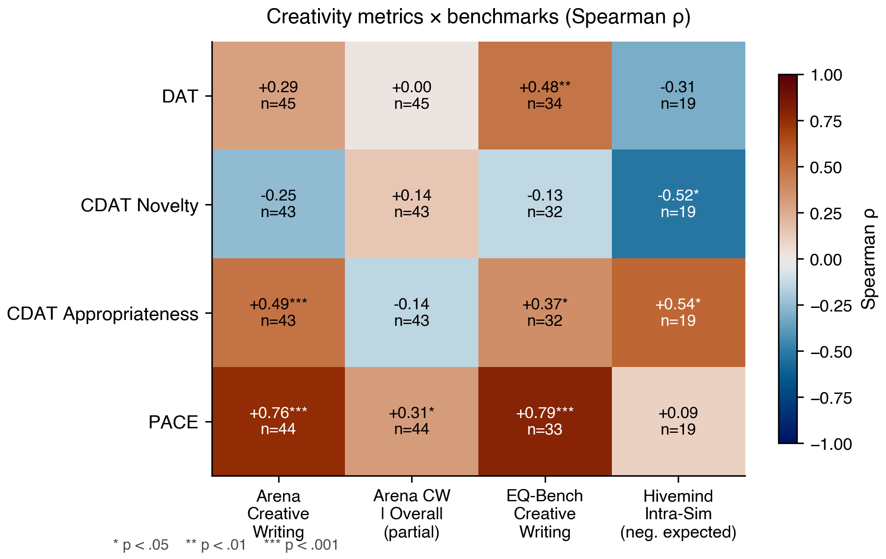
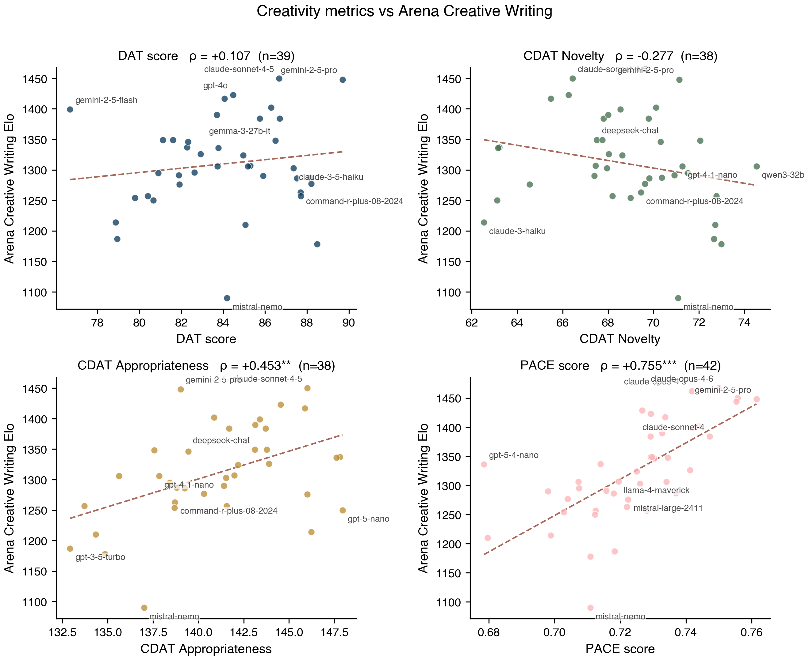
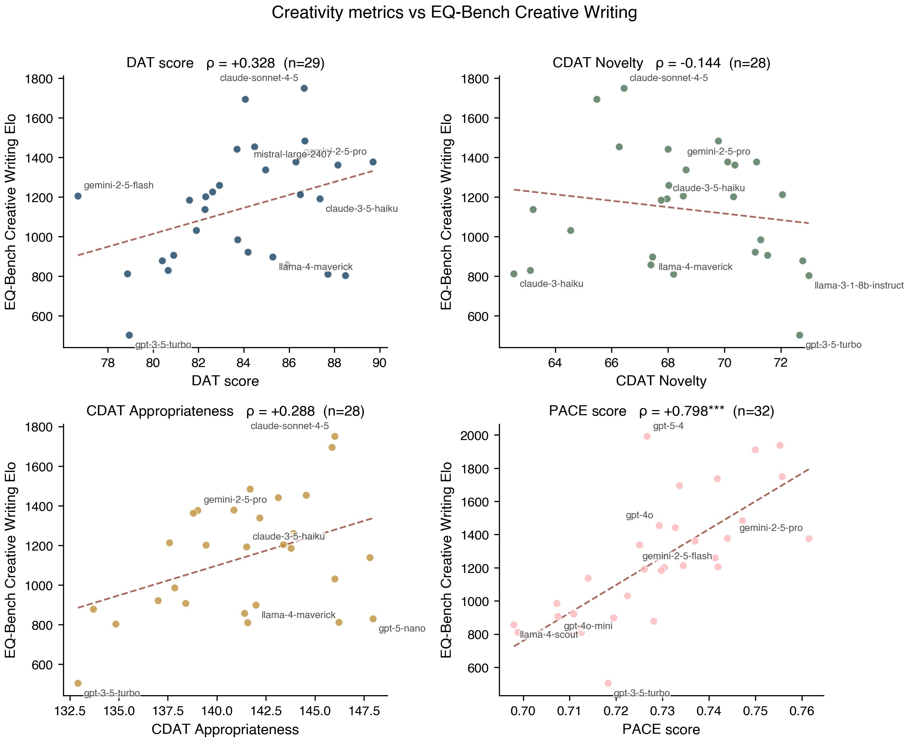
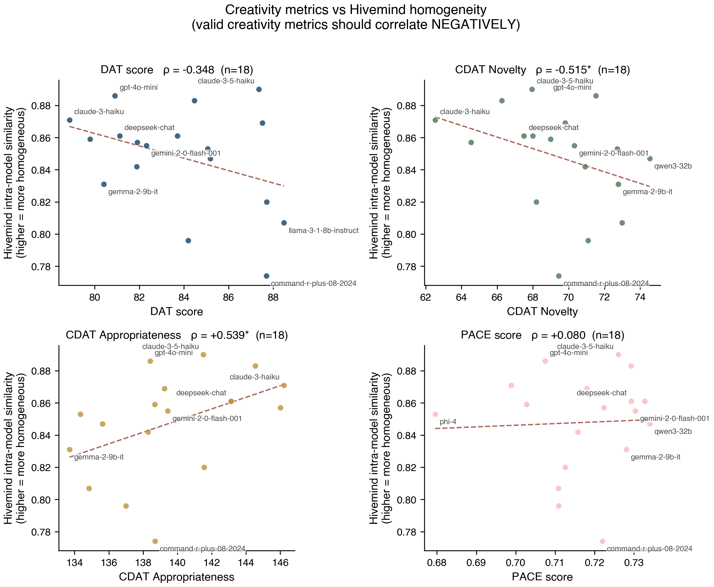
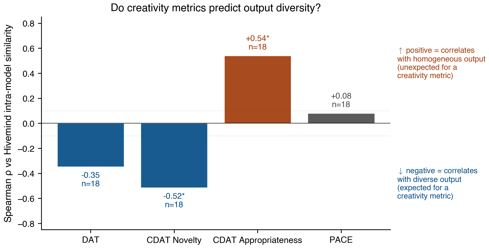
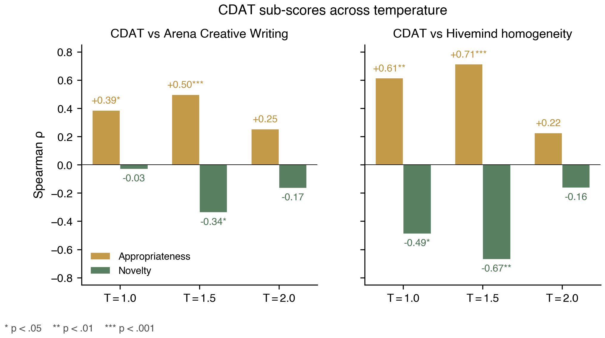

# Results: DAT/CDAT/PACE Correlations with Arena CW

**Date**: 2026-04-12 (updated)
**Status**: Near-final — 39 of 49 target models scored; 4 partial; budget cap stopped the run. Enough n for robust correlation analysis.
**Relates to**: [ICCC 2026 short paper](../2026-04-11_iccc_dat_study/report.md)

## Headline findings

Three creativity metrics evaluated against Chatbot Arena Creative Writing (CW) Elo rankings. All correlations are Spearman rank correlation. Bootstrap with 500 iterations for robustness. **Partial correlations** control for Arena Overall Elo to isolate creativity-specific signal from general model capability.

**Pooling convention**: for DAT and CDAT, the "pooled" score is the mean of every valid individual trial/cue score across all three temperatures (1.0, 1.5, 2.0), not the mean of per-temperature means. A model's pooled score therefore weights toward the temperatures at which it produced valid output. Per-temperature scores are also reported separately below.

### Correlation matrix: 4 creativity metrics × 4 benchmarks

| Metric | Arena CW | Partial (CW\|Overall) | EQ-Bench CW | Hivemind (should be neg.) |
|--------|----------|----------------------|-------------|---------------------------|
| **PACE** | **+0.755\*\*\*** | **+0.329\*** | **+0.798\*\*\*** | +0.08 NS |
| DAT | +0.107 NS | +0.019 NS | +0.328 (p=.08) | −0.348 NS |
| CDAT Novelty | −0.277 NS | +0.217 NS | −0.144 NS | **−0.515\*** ✓ |
| CDAT Appropriateness | +0.453\*\* | −0.226 NS | +0.288 NS | **+0.539\*** ✗ (wrong dir) |

### Scatter: each metric vs Arena Creative Writing

PACE (bottom-right) shows a clean upward relationship with Arena CW. DAT and CDAT Novelty show essentially no relationship; CDAT Appropriateness shows a weak trend driven by general capability.

### Scatter: each metric vs EQ-Bench Creative Writing

PACE's signal replicates on the EQ-Bench rubric-based benchmark (rho = +0.798, p < 0.0001). No other metric shows a robust relationship with EQ-Bench.

### Scatter: each metric vs Hivemind intra-model similarity

A valid creativity metric should correlate **negatively** with Hivemind homogeneity. Only CDAT Novelty cleanly does (rho = −0.515). CDAT Appropriateness correlates positively, the wrong direction. PACE is near zero.

### Direction check: do creativity metrics predict output diversity?

Green bars = expected direction. Red bar = unexpected. DAT and CDAT Novelty trend negative (diversity-predictive); CDAT Appropriateness trends strongly positive (homogeneity-predictive); PACE is essentially uncorrelated with output diversity.

### CDAT's temperature sensitivity

The novelty-appropriateness tradeoff is strongest at T=1.5. At every temperature, appropriateness and novelty have opposite signs, and the Hivemind correlation confirms that appropriateness tracks homogeneity while novelty tracks diversity.

### Per-temperature CDAT vs Hivemind (n=16–18)

| Metric | rho vs Hivemind | p |
|--------|------------------|---|
| CDAT Novelty t=1.5 | **−0.679** | **0.002** ✓ |
| CDAT Novelty t=1.0 | −0.472 | 0.048 ✓ |
| CDAT Approp t=1.5 | **+0.730** | **0.0006** ✗ |
| CDAT Approp t=1.0 | +0.609 | 0.007 ✗ |

### Four punchlines (four benchmarks)

1. **PACE is the only metric with creativity-specific signal in Arena CW.** Partial correlation controlling for Arena Overall stays at +0.329 (p=0.033). It also correlates at +0.798 with EQ-Bench CW (n=32, p<0.0001), which is an independent human-rubric creative writing benchmark. PACE is robust across benchmarks.

2. **CDAT's Arena CW correlation is an artifact of general capability.** All significant CDAT correlations with Arena CW and EQ-Bench CW collapse or reverse after partialing out Arena Overall. **CDAT measures general model quality, not creativity-specific ability.**

3. **DAT fails at every level.** Zero simple correlation, zero partial correlation. The one marginal finding (DAT vs EQ-Bench CW, rho=0.33 p=0.08) is not significant. **DAT is not a valid LLM creativity metric.**

4. **Hivemind homogeneity reveals that creativity has TWO dimensions.**
   - *Output diversity* (Hivemind, CDAT Novelty): CDAT Novelty correlates strongly negatively with Hivemind homogeneity (rho=−0.68 at t=1.5, p=0.002). CDAT Novelty IS picking up output diversity.
   - *Creative writing quality* (Arena CW, EQ-Bench, PACE): PACE correlates strongly with both creative writing benchmarks but NOT with output diversity.
   - **These are distinct.** Models that produce diverse outputs aren't necessarily the best creative writers. CDAT Appropriateness correlates *positively* with homogeneity (rho=+0.73 at t=1.5) — more appropriate = more conservative = more repetitive.

This splits the field: existing psycholinguistic metrics measure *diversity of word choices*; PACE measures *creative writing quality*. They are complementary, not redundant.

## Methodology (current run)

**Models**: 13 of 49 scored so far. The scored set over-represents frontier Anthropic models (PACE only) and smaller open models (full DAT/CDAT/PACE). The full-run evaluation is ongoing; results will shift as more models complete.

Scored models include: Claude Opus 4.5/4.6, Claude Sonnet 4.5/4.6, GPT-5.4, GPT-5.4-mini, Gemma 2 9B/27B, Gemma 3 27B, Llama 3.1 8B, Llama 4 Maverick, Qwen3 32B, Phi-4, Mistral Nemo.

**Temperatures**:
- DAT and CDAT: temps 1.0, 1.5, 2.0 with unique seed per trial, top_p=1.0, top_k=0
- PACE: temp 0.0 with input-driven variance across 50 seed words (paper convention)
- Max tokens per call capped to prevent runaway generation at high temps

**Sampling**: At temp=2.0 with top_p=1.0/top_k=0, weaker models (Llama 3.1 8B, Gemma 2 27B) produce garbage tokens in 40–100% of trials. Our scoring pipeline drops trials with <7 valid words and flags temperatures with no valid data as N/A rather than 0. The pooled score for a model is computed only over valid trials across temperatures.

**Concurrency**: All 3 eval types run with async OpenAI client and a 20-concurrent semaphore against OpenRouter. DAT for a model = ~3s, CDAT = ~3s, PACE = ~60-90s.

## Caveats

- **n is now reasonable** (38–42 per correlation) but missing some frontier models (Claude Opus 4.5/4.6, GPT-5.4, GPT-5, GPT-4 Turbo, o3, DeepSeek R1, o3-mini, o4-mini) because of the $30 budget cap. We have PACE-only data for some frontier Anthropic + OpenAI models which is why n=42 for PACE vs n=38–39 for DAT/CDAT.
- **Selection bias**: the full-metric sample over-represents open-source and mid-tier models; frontier reasoning models are under-represented.
- **Temperature-fixed models.** A few models (QwQ, some OpenAI reasoning models) had different temperature response than we expected. We accept the variance they produce via unique-seed sampling.
- **Reliability thresholds.** Following Nanda's writing advice, we treat p < 0.05 as suggestive, p < 0.01 as solid, and p < 0.001 as robust. PACE's simple correlation (p < 0.0001) is robust. PACE's partial correlation (p = 0.033) is suggestive — it would strengthen with more frontier models.

## Score ranges (sanity check against published work)

All three metrics are within their respective published ranges:

| Metric | Our range | Published range |
|--------|-----------|------------------|
| DAT (GloVe 840B) | 80–88 | Similar-scale papers: 70–85 at pooled temps |
| CDAT Novelty (SBERT) | 71–75 | Nakajima et al.: 60–78 |
| CDAT Appropriateness (SBERT) | 128–141 | Nakajima et al.: 125–150 |
| PACE (FastText) | 0.68–0.76 | Qiu & Hu: 0.72–0.79 |

Our PACE range slightly overlaps the low end of the published range, consistent with our 50-seed (vs their 110-seed) sample.

## What this means for the ICCC paper

The partial-correlation analysis sharpens the narrative:

1. **DAT fails to predict creative writing in LLMs.** Zero simple correlation (rho=0.107, NS), zero partial correlation (0.019). No signal at any temperature. Confirms the theoretical critique of Nakajima et al.: DAT rewards unrelated words, and unrelated words are not creativity.

2. **CDAT's CW correlation is an artifact of general model capability.** Both the appropriateness (+0.45) and novelty (-0.28) correlations with CW collapse to non-significance once Arena Overall is partialed out. The per-temperature correlations at t=1.5 that looked striking before (Approp +0.51**, Novelty -0.37*) also collapse. **This is an important critique of CDAT that the original paper did not address.**

3. **PACE is the only word-association-based metric with creativity-specific signal for LLMs.** Its correlation with Arena CW (rho=0.755) survives controlling for Arena Overall (partial rho=0.329, p=0.033). The story is: among three psycholinguistic metrics proposed for LLM creativity evaluation, only PACE's chain-based formulation captures something that creative-writing quality requires beyond general capability.

This is actually a *more controversial* and *cleaner* paper than the original plan. Two of three popular creativity metrics turn out to be general-capability proxies once we control for it.

## Next steps

- Continue the run until all 49 models are scored or the $30 budget cap is reached
- Re-run scoring when the full set is complete
- Compute partial correlations (CDAT / PACE vs Arena CW controlling for Arena Overall) to isolate creativity-specific signal from general capability
- Compute inter-metric correlations (do DAT, CDAT, PACE measure the same thing?) — preliminary: DAT vs PACE rho=0.00, DAT vs CDAT rho=0.43, PACE vs CDAT rho=0.07. They seem to measure mostly different things.

## Data

All scores: `data/dat_eval/run_v1/downstream/scores_v1/results/all_scores.json`
Correlation output: `data/dat_eval/run_v1/downstream/scores_v1/results/correlation_analysis.json`
