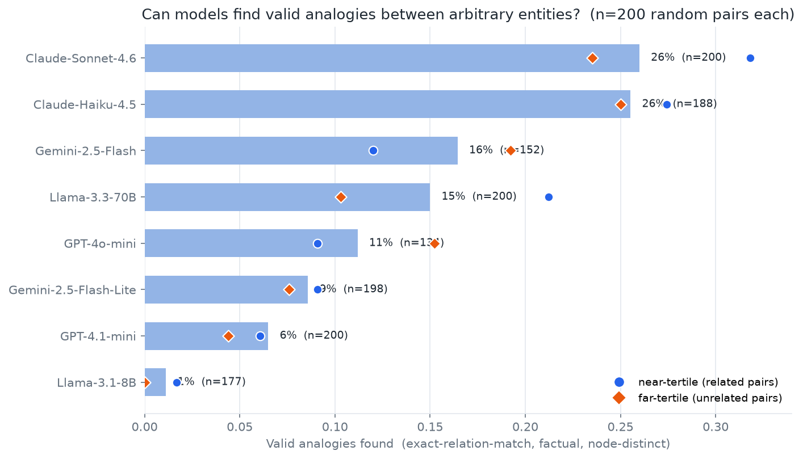
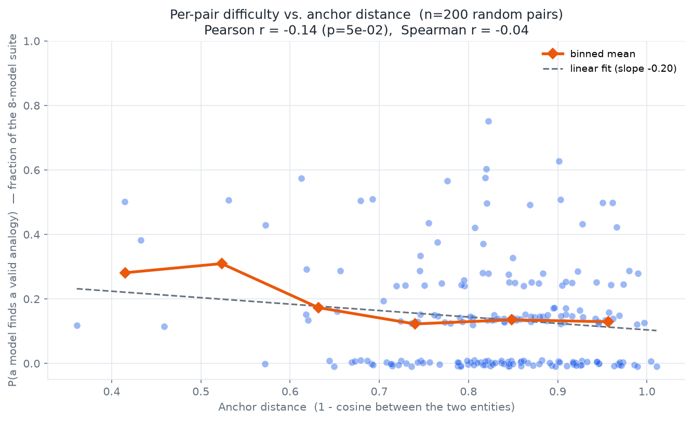

# Can LLMs find valid analogies between arbitrary entities?

**2026-07-20 · kg_creat track · 8-model analogy suite**

**TL;DR.** We ask whether models can discover a valid analogy between two *randomly paired*
knowledge-graph entities — pairs no human would set side by side. Requiring a genuine
structure-mapping (identical relation sequence, disjoint structures, factual, judged), even the
best models (Claude-Sonnet-4.6, Claude-Haiku-4.5) succeed only **~26 %** of the time on 200
random pairs, and the field spans **1 % → 26 %** across eight models.

## The task

Give a model two entities `u`, `v` and ask for a **deep analogy** between them: two parallel
structures (one per entity) sharing a relational skeleton, with corresponding positions playing
corresponding roles. Endpoints are **not curated** — they are random pairs drawn from the graph.
Curating canonical analogies (atom :: solar-system) would test analogies we already know exist;
the point is whether a model can bridge entities we would *not* expect it to. Difficulty is set
by the endpoints' embedding distance, not by the model.

## What counts as a valid analogy

Structure-mapping is strict, and all five must hold (checked without the judge except #5):

1. **Exact relation match** — both structures use the *identical* relation word at every position
   (`[created by, headquartered in]` in both), not paraphrases. *The prompt explicitly demands this.*
2. **Disjoint structures** — the two structures share no entity (two distinct systems, not one).
3. **Node-distinct** — neither structure revisits an entity (no circular / self-referential loops).
4. **Factual** — every triple in both structures judged non-hallucinated (`gpt-oss-120b`).
5. **Genuine analogy** — the judge confirms corresponding positions play corresponding roles.

*(Getting this definition right took several iterations: an early version accepted paraphrased
relations, loop-backs, and shared entities — each inflated the rate and was removed.)*

## Method (brief)

- **Substrate.** Domain-spanning Wikidata `G_c` — 3,442 entities across 13 domains (22
  domain-tagged seeds), 24 frequency-derived relations.
- **Prompts.** 200 random analogy pairs (169 cross-domain), seeded/reproducible, open vocabulary,
  with an explicit "use the EXACT SAME relationship word at every position" instruction.
- **Suite.** 8 models, cheap → frontier, judged by CREATE's `gpt-oss-120b`.

## Findings



| Model | Valid analogies (n = parsed) |
|---|---|
| **Claude-Sonnet-4.6** | 52 / 200 (**26.0 %**) |
| **Claude-Haiku-4.5** | 48 / 188 (**25.5 %**) |
| Gemini-2.5-Flash | 25 / 152 (16.4 %) |
| Llama-3.3-70B | 30 / 200 (15.0 %) |
| GPT-4o-mini | 15 / 134 (11.2 %) |
| Gemini-2.5-Flash-Lite | 17 / 198 (8.6 %) |
| GPT-4.1-mini | 13 / 200 (6.5 %) |
| Llama-3.1-8B | 2 / 177 (1.1 %) |

1. **Hard for everyone.** Even the top models find a valid strict analogy between arbitrary
   entities only ~1 in 4 times; most models are well under 20 %.
2. **Sonnet ≈ Haiku.** The frontier model is *not* better here — both Anthropic models tie at ~26 %,
   clear of the rest. Capability helps up to a point, then plateaus on this task.
3. **The distance effect is model-dependent** (near- vs far-tertile markers on the plot):
   Sonnet, Haiku, Llama-3.3-70B and GPT-4.1-mini decline as pairs get more unrelated; Gemini-2.5-Flash
   and GPT-4o-mini are flat or slightly *better* on far pairs. Not a universal falloff — treat the
   per-model direction cautiously at tertile n ≈ 50–65.

## Complementary analysis: is analogy difficulty explained by anchor distance?

Treating each **pair** as a data point, we estimate its difficulty as *P(a model finds the analogy)*
= the fraction of the 8-model suite that succeeds on it, and regress that on the anchors' embedding
distance.



- **Pearson r = −0.14 (p ≈ 0.05)** — a *weak* negative correlation, barely significant.
- **Spearman r = −0.04 (p = 0.54)** — the *rank* correlation is essentially **zero**.

The binned mean drops from ~30 % at the closest pairs (dist 0.4–0.55) to ~13 % by dist 0.7, then
goes **flat**: once entities are even moderately unrelated (> 0.6 — where random sampling puts almost
all pairs), the probability a model finds a valid analogy is **independent of how much more distant
they get**.

**Takeaway: anchor embedding distance barely predicts analogy difficulty.** Analogical mappability
is about shared *relational structure*, not surface similarity — two embedding-distant *organizations*
map easily (`established by → org, headquartered in → city`), while two embedding-close but
structurally-mismatched entities do not. Cosine distance measures the wrong thing for this task; the
real difficulty axis is structural, not distributional. *(The `dist < 0.55` end rests on only ~5–10
pairs and is noisy; the flat region beyond 0.6 is the solid part.)*

## Example valid analogies (all five checks pass)

```
[Sonnet, dist 0.98]  UN–AU Darfur Operation  ::  Nobel Prize in Physics
   relations: [established by, headquartered in]
   A: UNAMID       —established by→ UN Security Council —headquartered in→ New York City
   B: Nobel Prize  —established by→ Nobel Foundation    —headquartered in→ Stockholm

[Haiku, dist 0.99]  Order of the Crown  ::  psychological horror film
   relations: [belongs to, shapes]
   A: Order of the Crown       —belongs to→ honors system —shapes→ individual status
   B: psychological horror film —belongs to→ film genre   —shapes→ audience emotion
```

Both are real structure-mappings between unrelated domains with *identical* relations.

## Caveats

- **Judge reliability** is the load-bearing assumption; the semantic verdict is fuzzier than
  factuality. A human spot-check of ~20 verdicts is the outstanding reliability number.
- **Denominators differ** — rates are over *parsed* analogies; GPT-4o-mini (134) and Gemini-2.5-Flash
  (152) had lower format compliance under the strict prompt, so their rates aren't over the full 200.
  A stricter accounting (parse-failure = failure) would lower them.
- **`n = 200`**, single graph family (academia/awards-heavy from famous-entity seeds).
- **Distance is a weak predictor** (r ≈ −0.14, Spearman ≈ 0): the per-model tertile directions are
  suggestive, not established, and the pooled per-pair analysis shows difficulty is largely
  structural rather than distributional.

## Reproduce

```
build_gc (domain seeds) → sample_bundles (n_analogy 200, seed 0)
   → run_elicit (modes:[analogy], 8-model suite) → score (judge gpt-oss-120b)
   → plot_analogy_suite
```
Artifacts: `data/kg_creat/{gc_domains_v1, prompts_domains_v1, responses_analogy_v2, scores_analogy_v2}`.
Cost: elicitation ≈ $4.80 + judge ≈ $0.9.

## Next

- Human spot-check of judge verdicts (quantify semantic-tier reliability).
- Fix `score.py` to compute analogy success across both structures (currently `plot_analogy*` is
  the authoritative scorer; `score.py`'s per-mode analogy summary is approximate).
- Count parse failures as failures for a like-for-like model comparison.
- Broader / less academia-heavy seeds; more pairs to firm up the distance curve.
