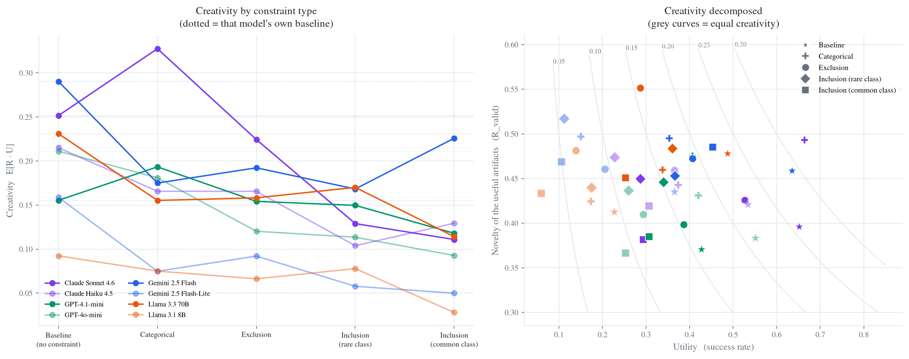

# How does creativity depend on constraint type?

**2026-07-21 · kg_creat track · Regime A, 8 models × 6 cells × 30 endpoint bundles**

**The question.** Creativity requires **novelty** *and* **utility**. Our constraints are the
utility operationalization: semantic and structural requirements a path must satisfy to be a
*useful* artifact, not merely a remote one. So the study is a single dependent variable —
creativity — measured across levels of one independent variable — constraint type.

Per `design.md` §Scoring, per-path creativity is `R(P) · U(P;x)` with
`U = (∏_t (1 + α_t·n_t)) · 1[valid ∧ factual]`. Utility is zero for any path that fails its
constraint, so a path contributes creativity only if it is *both* novel and useful. The cell
statistic is therefore `E[R·U]` over emitted paths.

**TL;DR.** Differencing each constraint against the **same endpoints** unconstrained (n ≈ 240
model × endpoint pairs per type), every constraint type significantly reduces creativity — but by
very different amounts and with very different consistency. **Ordering** is catastrophic and
near-universal (Δ = −0.181, hurting 83 % of pairs); **categorical** is nearly a coin flip
(Δ = −0.034, hurting only 52 % of pairs). This is not just difficulty: rare-inclusion and ordering
rule out the same share of models' default behaviour (99.2 % vs 98.6 %), yet differenced directly
on shared endpoints ordering is **0.100 worse** (p = 1.4e−18) — so constraint *type* matters beyond
restrictiveness, and specifically it is the **conjunction** of two class requirements that is
destructive. Constraints do genuinely raise novelty — ordering's successful paths are the *most
novel* in the study — but never by enough to pay for the utility they cost.

## Design

Every cell uses the **same 30 endpoint bundles** — the pair `(u, v)` is held fixed and only the
constraint changes, so the baseline→constrained displacement is causal in constraint *type*
rather than confounded by which entity pair was drawn. 8 models × 180 prompts × 5 paths =
**7,159 paths**, each judged for factuality (CREATE prompt K.2) and constraint satisfaction on
`gpt-oss-120b`.

| cell | what the model must do |
|---|---|
| baseline | any factual path `u → v` |
| exclusion | avoid a whole relation CLASS |
| inclusion | use a common relation class |
| inclusion (rare) | use a niche, domain-specific class (<8 % corpus share) |
| ordering | class A must appear before class B |
| categorical | pass through an entity of type `T` |

**Constraints are over relation CLASSES, not labels.** Under an open vocabulary a specific
relation string almost never recurs verbatim, so a label-level constraint would be satisfied or
violated by wording luck. We cluster the top-150 relations models actually emitted in the
baseline pass into 8 embedding-derived classes, name each with an LLM, and show the model
data-derived exemplars ("relationships like *cooperates with*, *influenced*, *ratified*").

**Targets are derived from each bundle's own baseline behaviour.** Per bundle, *exclusion*
targets the class that bundle used **most** when unconstrained; *inclusion* the least-used
still-usable class; *ordering* the **reverse** of that bundle's most frequent class ordering.
Each constraint bites by construction against that specific pair, rather than by assumption.

**On α.** Results are reported at `α = 0`, i.e. utility is the bare satisfaction indicator.
Because every cell here carries exactly one constraint of one type (`n_t = 1`), a *uniform* α
rescales all constrained cells identically and **cannot reorder them** — the constraint-type
ranking below is α-free. Only a per-type α could change it, and choosing those weights is
exactly the researcher degree of freedom the pre-registration exists to constrain.

## Result 1 — creativity by constraint type (paired, same endpoints)

The controlled comparison the design exists for: each constrained cell was administered on the
**same endpoint bundles** as the unconstrained baseline, so creativity is differenced *within
(model, endpoint pair)* rather than compared across marginal means. Some entity pairs are simply
richer than others, and a marginal comparison would let that variance leak into the constraint
effect. Unit = one model on one bundle, so n ≈ 240 paired observations per constraint type.

| constraint | paired Δ creativity | 95 % CI | pairs that decreased | Wilcoxon p |
|---|---|---|---|---|
| Categorical | **−0.034** | [−0.058, −0.009] | **52.1 %** | 0.017 |
| Exclusion | −0.056 | [−0.076, −0.036] | 60.9 % | 1.3e−07 |
| Inclusion (rare) | −0.081 | [−0.102, −0.060] | 66.7 % | 3.0e−12 |
| Inclusion (common) | −0.092 | [−0.112, −0.071] | 66.9 % | 1.8e−14 |
| **Ordering** | **−0.181** | [−0.198, −0.163] | **83.3 %** | 3.6e−34 |

Every constraint type significantly reduces creativity on matched endpoints, and the ordering is
strict. But the *character* of the effects differs sharply, and the "pairs that decreased" column
is where that shows:

- **Ordering is near-universal**: it hurts on 83 % of (model, endpoint) pairs. This is a property
  of the constraint, not of particular endpoints or models.
- **Categorical is nearly a coin flip**: creativity falls on only 52.1 % of pairs — barely
  distinguishable from chance, with the weakest effect size and by far the weakest p-value in the
  table. On matched endpoints, imposing a categorical constraint helps about as often as it hurts.
  Reporting only its −16 % marginal mean would obscure that.

For reference, the unpaired cell means (pooled over all 8 models) are: baseline 0.209,
categorical 0.176, exclusion 0.155, inclusion-rare 0.127, inclusion 0.116, ordering 0.029. The
paired and marginal analyses agree on the ranking, which is reassuring but not the point — the
paired version is what supports a causal reading.

**This ranking is identical to the ranking by utility alone.** That is a robustness result, not a
redundancy: the conclusion about which constraint types are costly does not depend on whether you
score utility by itself or creativity jointly. What the joint measure *adds* is Results 3 and 4,
which the utility-only view cannot express.

## Result 2 — the ranking is not just "how much the constraint rules out"

The deflationary reading of Result 1 is that these constraints differ in restrictiveness and
creativity simply tracks difficulty. To test it we need a difficulty covariate for the constraints
**as administered**. Since the relation-class targets were derived from baseline behaviour, the
natural measure is: *what share of the models' own unconstrained paths for that bundle would this
constraint kill?*

| cell | share of default paths ruled out | paired Δ creativity |
|---|---|---|
| exclusion | 0.506 | −0.056 |
| inclusion (common) | 0.907 | −0.092 |
| **inclusion (rare)** | **0.992** | **−0.081** |
| **ordering** | **0.986** | **−0.181** |
| categorical | 0.522 † | −0.034 |

Difficulty explains part of the ranking — exclusion rules out the least and costs least among the
relation-class constraints. But it **cannot explain ordering**. Rare-inclusion and ordering rule
out essentially the same share of default behaviour (99.2 % vs 98.6 %).

Differencing those two **directly, on shared endpoints**, isolates constraint type from
restrictiveness:

> **ordering − rare-inclusion**, paired on the same (model, endpoint): **Δ = −0.100**,
> 95 % CI [−0.119, −0.081], ordering worse on 63.2 % of pairs, *p* = 1.4e−18 (n = 239).

Two constraints that rule out the same share of default behaviour, administered on identical
endpoints, and ordering still destroys three times as much creativity. Constraint *type* carries
information beyond restrictiveness — specifically, it is the **conjunction** of two class
requirements that is destructive, not the mere fact of ruling out almost everything. A single
requirement almost no default path satisfies is survivable; two at once is not.

† Categorical's figure is not directly comparable: its targets are entity types rather than
relation classes, so it is measured as the share of enumerated `G_c` routes ruled out rather than
the share of default paths. It is reported to show categorical is not trivial (mean 0.522, min
0.344, and **0/30 cells below 0.30**), not to rank it against the others.

## Result 3 — constraints do raise novelty; it just isn't enough

Every constraint raises the novelty of the artifacts that succeed (`ΔR_valid` > 0 for all five),
and **ordering raises it the most** — its successful paths are the most novel in the study
(0.496 vs 0.420 unconstrained). Constraints genuinely do push models off their default,
low-remoteness routes, and the effect survives restriction to *useful* artifacts, so it is not an
artifact of averaging over paths that failed.

But the magnitudes do not compete. Novelty rises by ~0.02–0.08 while utility falls by 0.13–0.45.
Under a joint criterion the utility term dominates everywhere, and **no constraint type buys
enough novelty to pay for what it costs in utility**. The right-hand panel above makes this
concrete: iso-creativity curves are hyperbolas, and essentially every constrained cell sits on a
*lower* curve than its own baseline.

This is worth stating carefully, because a novelty-only reading of the same data — which is what
the ideation axis alone gives you — would report that constraints *increase* creativity. They
increase ideation. They decrease creativity.

## Result 4 — categorical is the only constraint that can beat the baseline

Aggregated per model, counting those whose paired creativity **exceeds** the unconstrained
baseline: exclusion 0/8, inclusion 0/8, inclusion-rare 0/8, ordering 0/8, **categorical 2/8** —
Claude Sonnet 4.6 (+0.072, creativity rising 0.252 → 0.328, the highest cell in the study) and
GPT-4.1-mini (+0.042). At the finer (model, endpoint) grain this is the same phenomenon seen in
Result 1: categorical *raises* creativity on 47.9 % of individual pairs, against 33 % for
inclusion and 17 % for ordering.

Categorical is also the only constrained cell that is not obviously on a novelty–utility
frontier: it has the **highest utility** of any constraint (0.376) while its realized novelty
(0.465) is essentially tied with the rare-inclusion and exclusion cells and behind only ordering.
It is not buying compliance by sacrificing remoteness — it dominates the other constraint types
on both terms at once.

A plausible mechanism, consistent with Result 5: categorical constrains *what the path must pass
through* while leaving the relational machinery free, whereas the four relation-class constraints
restrict the very vocabulary the model uses to build the path. Directing a search appears to be
cheaper than restricting it. The current design cannot separate this from the alternative that
our categorical targets were simply easier — see Threats.

## Result 5 — where utility is lost

Share of all paths ending in each failure channel (first failing gate, pooled over 8 models):

| cell | structural | factual | constraint |
|---|---|---|---|
| baseline | 15.1 % | 34.3 % | — |
| exclusion | 12.1 % | 40.0 % | 13.1 % |
| inclusion | 20.2 % | 38.5 % | 14.2 % |
| inclusion (rare) | 21.7 % | 34.4 % | 16.3 % |
| **ordering** | 14.4 % | 38.2 % | **41.6 %** |
| categorical | 16.5 % | 37.1 % | 8.4 % |

**Constraints do not make models hallucinate more.** The factual channel is a flat ~34–40 % tax
in every cell *including the baseline* (34.3 %). The entire cost of a constraint lands in the
constraint channel itself: models produce factual, well-formed paths that simply do not meet the
requirement.

## Result 6 — ordering fails as inclusion, not as ordering

Decomposing all 495 ordering constraint-failures by matching emitted relations against the class
member lists:

| what went wrong | share |
|---|---|
| 'after' class not present | 39.6 % |
| neither class present | 30.1 % |
| 'before' class not present | 18.2 % |
| **both present, order violated** | **11.5 %** |
| both present, order fine (judge disagreed) | 0.6 % |

Only about one in nine ordering failures is a genuine sequencing error. Overwhelmingly, models
fail by never getting both required relation classes into the path at all — ordering behaves like
a **double-inclusion** constraint, and the ordering requirement is close to moot.

Together with Result 2 this pins the mechanism down: ordering is not uniquely destructive *as
sequencing*, and not merely because it rules out a lot (rare-inclusion rules out just as much and
fares 4.4× better). It is destructive because it is the only cell demanding **two** specific
classes at once. A **"both classes, any order"** cell would confirm this directly, and it is the
obvious next run.

*Caveat:* presence is detected by exact string match against the class member lists (the top-150
relations), so a relation belonging to a class semantically but absent from that list counts as
missing. 11.5 % is therefore a **lower bound** on true sequencing errors. The direction is robust;
the exact split is not.

## Result 7 — per-model

Creativity `E[R·U]` per cell:

| model | baseline | categ | excl | incl-rare | incl | ordering |
|---|---|---|---|---|---|---|
| Gemini 2.5 Flash | 0.290 | 0.188 | 0.192 | 0.168 | 0.226 | 0.028 |
| Claude Sonnet 4.6 | 0.252 | **0.328** | 0.224 | 0.133 | 0.115 | 0.032 |
| GPT-4o-mini | 0.232 | 0.188 | 0.139 | 0.131 | 0.102 | 0.017 |
| Llama 3.3 70B | 0.231 | 0.162 | 0.166 | 0.170 | 0.121 | 0.025 |
| Claude Haiku 4.5 | 0.222 | 0.171 | 0.175 | 0.108 | 0.137 | 0.050 |
| Gemini 2.5 Flash-Lite | 0.171 | 0.078 | 0.097 | 0.060 | 0.059 | 0.025 |
| GPT-4.1-mini | 0.167 | **0.209** | 0.164 | 0.156 | 0.133 | 0.041 |
| Llama 3.1 8B | 0.111 | 0.086 | 0.079 | 0.089 | 0.035 | 0.012 |

Ordering is the worst cell for **every** model tested, strongest included. The rare-vs-common
inclusion contrast is weak and inconsistent in sign (Haiku is hurt by rarity, Llama 3.3 70B is
helped), so whatever makes inclusion hard is apparently not the target class's corpus frequency.

## Threats to validity

- **Endpoint matching was too lenient; fixed, conclusions unchanged.** The scorer inherited
  CREATE-style bidirectional substring matching for endpoints, which accepts a *different* entity
  whenever one label contains the other: a path ending at `australia group export controls` or
  `united nations office for outer space affairs` counted as having reached `Australia Group` /
  `United Nations`. 6.4 % of well-formed paths had inexact endpoints and ~81 % of those were the
  wrong entity rather than a qualifier variant, and the rate was uneven across cells (inclusion
  9.3 % vs ordering 4.5 %), so it perturbed the deltas. Matching now requires equality up to a
  trailing parenthetical. Re-deriving every path offline (no re-judging needed — stricter matching
  only removes well-formed status, and the judge verdicts were already stored) moved 313 paths
  (4.4 %) and **changed no conclusion**: identical constraint ranking, categorical still the only
  cell with creativity gains and still for the same 2 of 8 models, paired deltas shifting by
  ≤ 0.009. All numbers above are the strict re-derivation; the lenient scores are retained in
  `data/kg_creat/scores_regimeA_lenient/` for comparison.
- **Ambiguous endpoint labels weaken the pairing for ~3 bundles.** Qualifier-stripping is
  deliberately kept, but it lets genuinely different senses of an ambiguous label both count as
  the endpoint. In bundles A10/A11 models resolved "Brazil" as both the country and the 1985 film
  across cells, and in A13 "Paul McCartney" appears as the musician, an album, and a footballer
  born 2001. For those bundles the "same endpoints" premise does not strictly hold. It affects
  baseline and constrained cells alike, so it adds noise rather than directional bias, but an
  endpoint pool screened for label ambiguity would remove it.
- **Exemplar noise in the derived classes.** The model is shown four exemplars per class, taken
  from the cluster's members, and some members do not fit their cluster's LLM-assigned name:
  `"country"` appears as an *international relations* exemplar, `"established"` as *location or
  origin*, `"focuses on"` as *affiliation*, `"signed"` as *membership*. This weakens the construct
  labels — "international relations" names the cluster loosely. It does **not** make the task
  unfair, because the judge is given the same class name and exemplar list the model saw, so a
  model is graded against the definition it received. But a cell's difficulty partly reflects how
  coherent its cluster happened to be, which the current design cannot separate from the
  constraint type itself.
- **Grammar defect in the shipped ordering prompt.** The administered ordering clause read
  "a affiliation-type relationship" for vowel-initial class names (fixed after the run). All 8
  models saw the same text, so it cannot bias between-model comparisons, but it is a small
  fluency confound on the ordering cell specifically.
- **Judge-dependence.** With class-level constraints, utility for all five cells is judged rather
  than exactly checked. A human blind reliability pass on the judge is built but **still owed** —
  every number here rests on `gpt-oss-120b` agreement that has not been human-audited for the
  relation-class prompts specifically.
- **Categorical is measured on a different difficulty scale.** Audited: the 30 targets are mostly
  specific ("international organization" ×9, "colonial power" ×4, "superpower" ×3) with only one
  generic case (`'human'`), and none rules out less than 34 % of enumerated `G_c` routes. So
  categorical is *not* trivial. But its difficulty is measured over graph routes while the
  relation-class cells are measured over models' default paths, so **Result 4's cross-type claim
  rests on a difficulty comparison that is not apples-to-apples.** Result 2's core comparison
  (rare-inclusion vs ordering) does not depend on categorical and is unaffected.
- **Biting is computed by exact string match** against class member lists, which understates class
  presence and therefore overstates how much each relation-class constraint rules out. Applied
  uniformly across those four cells, so the comparison between them is fair; the absolute levels
  are upper bounds.
- **Truncation artifact, caught and fixed.** The first elicitation pass ran at `max_tokens=1200`,
  cutting long answers mid-JSON; a truncated answer parses to zero paths and would score as a
  structural failure. GPT-4o-mini lost 104/180 prompts this way. Fixed by salvaging complete paths
  from truncated JSON (keeping only paths whose array actually closed) and re-firing the 12
  hardest cases. **Any cross-model structural comparison run before this fix is invalid.**
- **A judge hole, caught and fixed.** The categorical judge ran at `max_tokens=400`; a reasoning
  judge spends a small budget thinking and never emits JSON, silently turning satisfaction into
  `unjudged` (123 categorical paths). After raising to 800 and re-judging, unjudged fell 196 → 9
  (0.13 %).
- **Novelty is embedding remoteness only.** `R` is DAT-style mean pairwise cosine distance. Set
  diversity `D` is not folded in, so "creativity" here is per-path, not per-response-set.
- **Domain skew.** The endpoint pool is country/organization-heavy, bounding generalization.
- **Floor effects.** Models with low baselines have less room to fall, compressing their deltas.

## Cost

Elicitation $4.32, judging ~$2.2, re-judge $0.09. **~$6.6 total.**

## Next

- Add a **"both classes, any order"** cell to separate ordering-as-sequencing from
  ordering-as-double-inclusion (Result 5).
- Human blind judge-reliability pass (owed since the analogy round).
- Run the reframed **blending** task at scale — single anchor, two structures emanating outward
  into different domains.
- Re-run the Result 5 decomposition with semantic rather than exact class matching.

## Appendix A — paired failure examples

Same model, same endpoints, unconstrained success beside the constrained failure. Only
constraint-channel failures are shown: a path that failed by hallucinating an edge says nothing
about what the constraint did. Generated by `src/kg_creat/scripts/show_failures.py`.

Two failure modes recur across every constraint type.

**(i) Minimal edit — the model changes a word rather than the path.**

| | |
|---|---|
| Claude Haiku 4.5 · United Kingdom → Paul McCartney | *avoid ALL participation relations* |
| unconstrained ✓ | `united kingdom —[is home to]→ the beatles —[member]→ paul mccartney` |
| constrained ✗ | `united kingdom —[is home to]→ the beatles —[included member]→ paul mccartney` |
| | It kept the forbidden relation (`is home to`) and edited the *other* hop. |

| | |
|---|---|
| Claude Sonnet 4.6 · Japan → United Nations | *use at least one international-relations relation* |
| unconstrained ✓ | `japan —[contributes to]→ un peacekeeping operations —[operated by]→ united nations` |
| constrained ✗ | `japan —[contributes to]→ un peacekeeping operations —[administered by]→ united nations` |
| | One word changed; the required class never appears. |

| | |
|---|---|
| Claude Haiku 4.5 · Germany → Australia Group | *use at least one location-or-origin relation* |
| unconstrained ✓ | `germany —[is member of]→ nuclear suppliers group —[coordinates with]→ australia group` |
| constrained ✗ | `germany —[member of]→ nuclear suppliers group —[coordinates with]→ australia group` |
| | Functionally the same path; the constraint is ignored outright. |

**(ii) Clean rebuild that never addresses the constraint.** The model returns a different,
perfectly factual path — it simply does not encode the requirement. This is the dominant ordering
failure, and it is what Result 5 measures in aggregate:

| | |
|---|---|
| Claude Haiku 4.5 · United States → United Kingdom | *participation must precede membership* |
| unconstrained ✓ | `united states —[home to]→ harvard —[academic partnership with]→ cambridge —[located in]→ united kingdom` |
| constrained ✗ | `united states —[signatory to]→ treaty of paris (1783) —[recognizes independence from]→ united kingdom` |
| | Contains **neither** required class — nothing to order. |

| | |
|---|---|
| Gemini 2.5 Flash · United States → Australia Group | *membership must precede participation* |
| unconstrained ✓ | `united states —[member of]→ nato —[cooperates with]→ australia group` |
| constrained ✗ | `united states —[has diplomatic relations with]→ european union —[is represented in]→ australia group` |
| | The unconstrained path already satisfied the ordering; the constrained one abandons it. |

That last case is the sharpest: **naming the constraint made the model abandon a path that already
satisfied it.** The baseline `member of → cooperates with` is exactly membership-before-participation.

**Categorical failures are judge-borderline more often than the others**, which is why the owed
reliability pass matters most for this cell:

| | |
|---|---|
| Claude Sonnet 4.6 · Brazil → Alfred Hitchcock | *pass through a kind of 'superpower'* |
| constrained ✗ | `brazil —[diplomatic relations with]→ france —[awarded légion d'honneur to]→ alfred hitchcock` |
| | Is France a "superpower"? Defensible either way — and the verdict decides the cell. |

| | |
|---|---|
| Gemini 2.5 Flash · Germany → United Nations | *pass through a kind of 'international organization'* |
| constrained ✗ | `germany —[host country for]→ un campus bonn —[site of]→ un volunteers —[program of]→ united nations` |
| | `UN Volunteers` is a UN programme; rejecting it is right but not obvious. |
