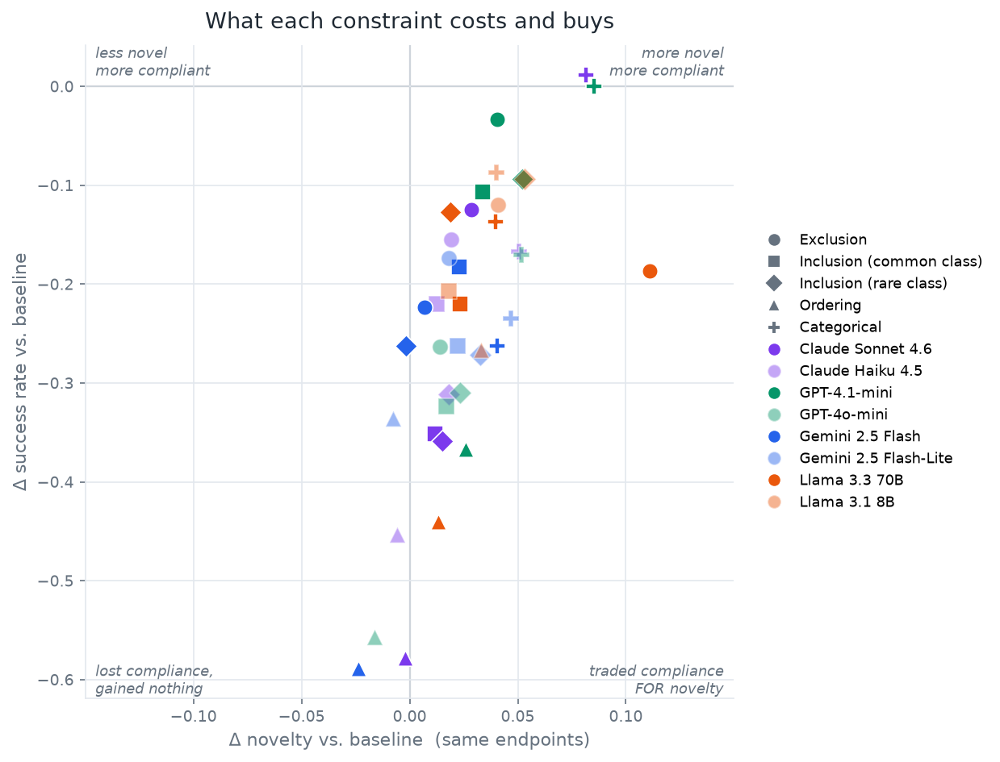
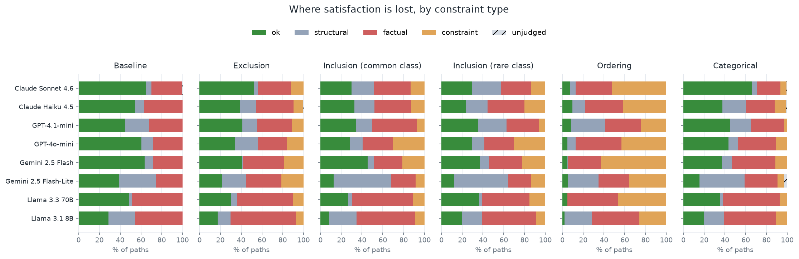

# What does each constraint type actually cost a model?

**2026-07-21 · kg_creat track · Regime A, 8 models × 6 cells × 30 endpoint bundles**

**TL;DR.** On a fixed set of 30 entity pairs we ask eight models for connection paths under five
different constraint types plus an unconstrained baseline. Every constraint costs success, but
they are not the same *kind* of hard: **ordering costs 2–3× more than any other constraint
(Δsat −0.45) and buys no novelty at all**, while **categorical is the efficient lever** (most
novelty bought, least compliance lost).

Two things the failure decomposition shows. First, constraints do not make models hallucinate more:
the factual failure rate is a flat ~34–40 % tax in every cell *including the baseline*. What
constraints add is constraint-channel failure, and under ordering that channel alone accounts for
**41.6 %** of all paths versus 8–16 % elsewhere. Second, ordering is not mostly failing *as
sequencing* — only 11.5 % of its failures are genuine order violations. Models fail it by never
getting both required relation classes into the path at all, which makes it behave like a double
inclusion constraint rather than an ordering one.

## Design

Every cell uses the **same 30 endpoint bundles** — the pair `(u, v)` is held fixed and only the
constraint changes. That makes the baseline→constrained displacement causal in constraint *type*
rather than confounded by which entity pair happened to be drawn. 8 models × 180 prompts × 5 paths
= **7,159 paths**, each judged for factuality (CREATE prompt K.2) and constraint satisfaction on
`gpt-oss-120b`.

| cell | what the model must do |
|---|---|
| baseline | any factual path `u → v` |
| exclusion | avoid a whole relation CLASS |
| inclusion | use a common relation class |
| inclusion (rare) | use a niche, domain-specific class (<8 % corpus share) |
| ordering | class A must appear before class B |
| categorical | pass through an entity of type `T` |

Two design choices matter for reading the numbers:

**Constraints are over relation CLASSES, not labels.** Under an open vocabulary a specific
relation string almost never recurs verbatim, so a label-level constraint would be satisfied or
violated by wording luck. We cluster the top-150 relations models actually emitted in the baseline
pass into 8 embedding-derived classes, name each with an LLM, and show the model data-derived
exemplars ("relationships like *cooperates with*, *influenced*, *ratified*").

**Targets are derived from each bundle's own baseline behaviour.** Per bundle, *exclusion* targets
the class that bundle used **most** when unconstrained; *inclusion* the least-used still-usable
class; *ordering* the **reverse** of that bundle's most frequent class ordering. Each constraint
therefore bites by construction against that specific pair, rather than by assumption.

## Result 1 — the constraints are not equally hard

Pooled within-bundle deltas vs. each model's own baseline on the same endpoints:

| | exclusion | inclusion | inclusion (rare) | **ordering** | categorical |
|---|---|---|---|---|---|
| Δ success | −0.160 | −0.234 | −0.228 | **−0.448** | −0.131 |
| Δ novelty | +0.035 | +0.020 | +0.026 | **+0.002** | **+0.055** |

Ordering sits alone at the bottom of the figure and buys nothing for what it costs. Every other
constraint at least trades compliance for remoteness; ordering is pure cost. This is consistent
across all eight models — the triangles cluster regardless of family or capability, which is what
makes it look like a property of the *task* rather than of any model.

Categorical is the opposite: the largest novelty gain (+0.055) for the smallest compliance loss.
Being told to route through a *type* of entity pushes models off their default path without
constraining the relational machinery they use to get there.

## Result 2 — constraints don't degrade factuality, they defeat compliance

Share of all paths ending in each failure channel (first failing gate, pooled over 8 models):

| cell | structural | factual | constraint |
|---|---|---|---|
| baseline | 15.1 % | 34.3 % | — |
| exclusion | 12.1 % | 40.0 % | 13.1 % |
| inclusion | 20.2 % | 38.5 % | 14.2 % |
| inclusion (rare) | 21.7 % | 34.4 % | 16.3 % |
| **ordering** | 14.4 % | 38.2 % | **41.6 %** |
| categorical | 16.5 % | 37.1 % | 8.4 % |

The factual channel barely moves (34.3 % unconstrained → 34–40 % constrained). Models hallucinate
links at a roughly constant rate whatever we ask of them; the constraint does not push them into
making things up. The whole cost of a constraint shows up in the constraint channel itself: models
produce factual, well-formed paths that simply do not meet the requirement — a *planning* failure,
not a knowledge failure. Result 2b breaks the ordering case down further.

## Result 2b — ordering fails as *inclusion*, not as ordering

Decomposing all 495 ordering constraint-failures by matching emitted relations against the class
member lists:

| what went wrong | share |
|---|---|
| 'after' class not present | 39.6 % |
| neither class present | 30.1 % |
| 'before' class not present | 18.2 % |
| **both present, order violated** | **11.5 %** |
| both present, order fine (judge disagreed) | 0.6 % |

Only about one in nine ordering failures is a genuine sequencing error. Overwhelmingly, models fail
the ordering constraint by never getting both required relation classes into the path — it is a
*double inclusion* constraint they are failing, and the ordering requirement is close to moot.

This reframes Result 1: ordering may not be uniquely hard *as sequencing*. It is hard because it is
the only cell demanding two specific classes at once, and satisfying two class constraints
simultaneously on a fixed pair of endpoints is close to infeasible. That is a testable claim — a
"both classes, any order" cell would separate the two explanations, and it is the obvious next run.

*Caveat:* presence is detected by exact string match against the class member lists (the top-150
relations), so a relation that belongs to a class semantically but is not in that list counts as
absent. This understates presence, meaning 11.5 % is a **lower bound** on true sequencing errors —
the judge reasons semantically and would have credited some of them. The direction of the result
is robust to that; the exact split is not.

## Result 3 — per-model

Success rate per cell (higher = better):

| model | baseline | excl | incl | incl-rare | ordering | categ |
|---|---|---|---|---|---|---|
| Claude Sonnet 4.6 | 0.651 | 0.527 | 0.300 | 0.293 | 0.073 | **0.664** |
| Gemini 2.5 Flash | 0.635 | 0.407 | 0.453 | 0.366 | 0.048 | 0.373 |
| GPT-4o-mini | 0.604 | 0.340 | 0.280 | 0.293 | 0.047 | 0.433 |
| Claude Haiku 4.5 | 0.547 | 0.392 | 0.327 | 0.235 | 0.095 | 0.381 |
| Llama 3.3 70B | 0.487 | 0.300 | 0.267 | 0.360 | 0.047 | 0.351 |
| GPT-4.1-mini | 0.447 | 0.413 | 0.340 | 0.353 | 0.082 | 0.447 |
| Gemini 2.5 Flash-Lite | 0.392 | 0.219 | 0.126 | 0.118 | 0.052 | 0.159 |
| Llama 3.1 8B | 0.287 | 0.174 | 0.080 | 0.195 | 0.020 | 0.200 |

Ordering is under 0.10 for **every model tested**, including the strongest. Sonnet 4.6 is the only
model whose categorical score *exceeds* its own baseline (0.664 vs 0.651) — being pointed at an
entity type appears to help it more than the free-form task does.

The rare-vs-common inclusion contrast is weaker than expected: pooled, the two are nearly
identical (−0.228 vs −0.234), though individual models diverge (Haiku 0.327→0.235 with rarity;
Llama 3.3 70B moves the *other* way, 0.267→0.360). Whatever makes inclusion hard is apparently not
the target class's corpus frequency.

## Threats to validity

- **Judge-dependence.** With class-level constraints, `sat` for all five cells is now judged rather
  than exactly checked. A human blind reliability pass on the judge is built but **still owed** —
  the numbers above rest on `gpt-oss-120b` agreement that has not been human-audited for the
  relation-class prompts specifically.
- **Truncation artifact, caught and fixed.** The first elicitation pass ran at `max_tokens=1200`,
  which cut long answers mid-JSON; a truncated answer parses to zero paths and would have scored as
  a structural failure. GPT-4o-mini lost 104/180 prompts this way — it would have read as a 60 %
  structural failure rate that was really a token cap meeting a verbose model. Fixed by salvaging
  complete paths from truncated JSON (keeping only paths whose array actually closed, so a
  half-emitted path is not scored as "never reached the target") and re-firing the 12 hardest cases.
  All models now sit at ~5.0 paths/prompt. **Any cross-model structural comparison run before this
  fix is invalid.**
- **A judge hole, caught and fixed.** The categorical judge ran at `max_tokens=400`; a reasoning
  judge spends a small budget thinking and never emits JSON, silently turning satisfaction into
  `unjudged`. 123 categorical paths were affected. After raising to 800 and re-judging, unjudged
  fell 196 → 9 paths (0.13 %).
- **Domain skew.** The endpoint pool is country/organization-heavy, so the relation classes are
  dominated by membership/location/affiliation. This is accepted for round 1 but bounds how far the
  "categorical is efficient" claim generalizes.
- **Floor effects.** Models with low baselines (Llama 3.1 8B at 0.287) have less room to fall, which
  compresses their deltas relative to stronger models.

## Cost

Elicitation $4.32 (pass 1 $0.72 + pass 2 $3.60), judging ~$2.2, re-judge $0.09. **~$6.6 total.**

## Next

- Human blind judge-reliability pass (owed since the analogy round).
- Run the reframed **blending** task at scale — single anchor, two structures emanating outward
  into different domains. Smoke-tested at 8 anchors: Sonnet 4.6 8/8 structurally valid,
  Gemini Flash-Lite 0/8.
- Add a **"both classes, any order"** cell to separate ordering-as-sequencing from
  ordering-as-double-inclusion (see Result 2b) — the single most informative next run.
- Re-run the Result 2b decomposition with semantic class matching rather than exact string
  matching, to tighten the 11.5 % lower bound.
