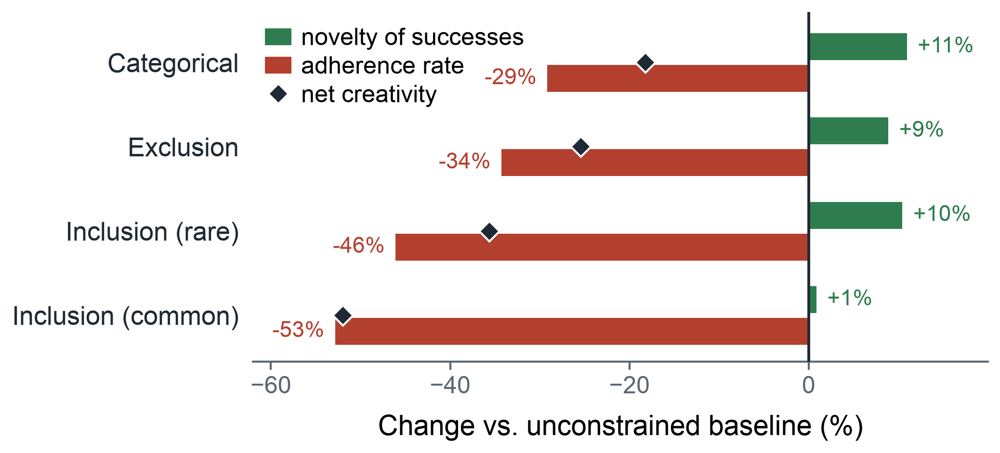

# Constraints are a novelty lever that models can't cash in

**2026-07-22 · kg_creat track · Regime A · 8 models × 30 fixed endpoint bundles**

Creativity is novelty *and* utility — a remote artifact that is also fit for the requirement. In
this benchmark the constraints *are* the utility requirement: to be useful, a path from `u` to `v`
must be factual, well-formed, and satisfy a semantic/structural constraint. So the study has one
dependent variable, creativity `E[R·U]`, and one independent variable, constraint type.

**The headline.** A constraint does two opposite things at once. It **raises novelty** — the paths a
model produces under a constraint are measurably more remote — and it **lowers adherence** — the
model satisfies the requirement far less often. The novelty gain is real and causal (it shows up
even before any success filtering), but small; the adherence loss is large. Net creativity is their
product, so it falls. The exception proves the rule: the one constraint whose novelty push is large
and whose adherence cost is small — *categorical* — is the only one that comes near break-even, and
for two models actually clears it.

The constraint set is **four types**: categorical, exclusion, and inclusion in two variants (common
and rare relation class). A fifth — ordering — was piloted and **dropped** as confounded by
construction (Appendix A). Every cell is administered on the **same 30 endpoint pairs**, so within a
pair only the constraint changes and every comparison is a model differenced against itself.

---

## 1. One endpoint pair, five cells

Claude Sonnet 4.6 on the single pair **Japan → United Nations**, one path per cell — the whole
experiment in miniature. The endpoints never move; only the demand does.

| cell | constraint | path | verdict |
|---|---|---|---|
| baseline | *(none)* | japan —[represented by]→ Kōichirō Matsuura —[director-general of]→ UNESCO —[specialized agency of]→ UN | ✓ |
| categorical | through a kind of *international organization* | japan —[member of]→ WHO —[specialized agency of]→ UN | ✓ |
| exclusion | avoid *membership* relations | japan —[hosts headquarters of]→ UN University —[chartered by]→ UN | ✓ |
| inclusion (rare) | use an *international-relations* relation | japan —[hosts headquarters of]→ UN University —[chartered by]→ UN | ✓ |
| inclusion (common) | use a *location-or-origin* relation | japan —[joined]→ UN —[headquartered in]→ New York City | ✗ structural |

The inclusion failure previews the whole result: the model bolts the required relation on at the end
(`… —[headquartered in]→ New York City`) and in doing so **runs off the target**, never reaching the
UN. It reached for the constraint and dropped the path.

---

## 2. The two mechanisms: a novelty gain and an adherence loss

Creativity factorises: `E[R·U]` over emitted paths equals `R_valid × adherence` — the mean novelty
of the *successful* paths times the fraction that succeed. So a constraint acts through two
multiplicative factors, and we can measure how it moves each (mean over models of the per-model
change vs its own baseline):



| constraint | novelty of successes | adherence rate | net creativity |
|---|---|---|---|
| categorical | **+11 %** | −27 % | −16 % |
| exclusion | +9 % | −33 % | −27 % |
| inclusion (rare) | +11 % | −43 % | −37 % |
| inclusion (common) | **+1 %** | −50 % | −48 % |

Every constraint pushes novelty up and adherence down; the adherence factor dominates, so net
creativity (their per-model product — not the sum of the two columns, since percentage changes don't
add) falls. But the factors are not fixed — categorical raises novelty most (+11 %) and costs
adherence least (−27 %), which is exactly why its net is smallest.

**The novelty gain is causal, not survivorship.** A skeptic's first objection: `R_valid` is novelty
*conditional on success*, so maybe constraints don't make paths novel — they just select the novel
ones that happen to satisfy. Two controls rule this out:

- **Novelty rises in `R_emit`, over *all* emitted paths including failures** (+0.019 to +0.053).
  A pure selection effect could not move a mean that already contains the failures. The constraint
  changes what the model *reaches for*.
- **It survives holding endpoints fixed.** Comparing a model's *successful constrained* paths to its
  *successful baseline* paths on the **same bundle**, the constrained success is more novel by +0.028
  to +0.072 (in 56–76 % of bundles). Not a between-endpoint artifact.

**Where the novelty gain comes from.** Look at the one constraint that *doesn't* raise novelty:
inclusion of a **common** class (+1 %). The others all push models toward *less-traveled* relations —
a rare class, a forbidden default, a redirected waypoint — and each buys ~+9–11 % novelty. Requiring
a *common* relation pushes nowhere, so it buys nothing and is the worst cell for creativity. The
novelty lever is specifically "go somewhere you usually wouldn't."

---

## 3. The net effect: creativity falls under every constraint


Each box is the 8 per-model paired effects (constrained − unconstrained, same endpoints); stars are
a one-sample t-test on those 8 values, Holm-corrected.

| cell | creativity `E[R·U]` | paired Δ vs baseline | sig. |
|---|---|---|---|
| baseline | 0.201 | — | |
| categorical | 0.168 | −16 % | n.s. |
| exclusion | 0.147 | −27 % | ** |
| inclusion (rare) | 0.121 | −37 % | ** |
| inclusion (common) | 0.109 | −48 % | ** |

The three relation-class constraints lower creativity significantly and consistently. Categorical is
the only cell whose effect the 8 models do not agree on — mean negative but not distinguishable from
zero, because two models actually gain (§6).

---

## 4. Why adherence drops: two failure modes

Restricting to **constraint-channel** failures (factual, well-formed paths that just miss the
requirement), two behaviours recur across every constraint type.

### (a) The minimal edit — change a word, not the path

The model keeps its default path and tweaks a single surface token, which does not move the
underlying relation into (or out of) the target class.

**Haiku 4.5 · UK → Paul McCartney · *avoid all participation relations***
```
✓ unconstrained:  united kingdom —[is home to]→ the beatles —[member]→ paul mccartney
✗ constrained:    united kingdom —[is home to]→ the beatles —[included member]→ paul mccartney
```
It edited the *second* hop (`member` → `included member`) and left the forbidden `is home to`
untouched — changing the one relation that was already fine.

**Sonnet 4.6 · Japan → UN · *use an international-relations relation***
```
✓ unconstrained:  japan —[contributes to]→ un peacekeeping ops —[operated by]→ united nations
✗ constrained:    japan —[contributes to]→ un peacekeeping ops —[administered by]→ united nations
```
`operated by` → `administered by`. One synonym swapped; the required class never appears.

**Haiku 4.5 · Germany → Australia Group · *use a location-or-origin relation***
```
✓ unconstrained:  germany —[is member of]→ nuclear suppliers group —[coordinates with]→ australia group
✗ constrained:    germany —[member of]→ nuclear suppliers group —[coordinates with]→ australia group
```
`is member of` → `member of`. Functionally the identical path; the constraint is simply ignored.

### (b) The clean rebuild — a different path that still doesn't satisfy the demand

The model *does* produce a new, perfectly factual path that nonetheless misses the constraint.

**Gemini 2.5 Flash · US → UK · *avoid all location-or-origin relations***
```
✓ unconstrained:  united states —[colonized by]→ great britain —[historical entity]→ united kingdom
✗ constrained:    united states —[founded by]→ thirteen colonies —[formerly part of]→ united kingdom
```
Completely rebuilt — and its first hop `founded by` is itself a location-or-origin relation, so the
rebuild reintroduced exactly the class it was told to avoid.

**Sonnet 4.6 · Brazil → Golden Globe Awards · *avoid all participation relations***
```
✓ unconstrained:  brazil (film) —[directed by]→ terry gilliam —[directed]→ the fisher king —[nominated for]→ golden globe awards
✗ constrained:    brazil (film) —[starred]→ jonathan pryce —[starred in]→ evita —[won]→ golden globe awards
```
A rebuilt cast-based path — and its final hop `won` is a participation relation, so again the rebuild
reintroduced the forbidden class.

---

## 5. Constraints do not make models hallucinate — they defeat compliance

If constraints pushed models past the edge of their knowledge, we'd see the **factual** failure
channel swell under constraint. It does not: factual failures sit at a flat ~32–37 % in every cell,
*including the unconstrained baseline* (32.3 %). Hallucination is a roughly constant background tax,
not a constraint effect. The entire *added* cost of a constraint lands in the **constraint** channel
(7.9 % categorical → 15.5 % rare-inclusion) — the adherence loss of §2 — and those failures are
typically paths that are factually fine.


That baseline factuality floor is real — these are *unconstrained* paths the judge rejected as
hallucinated:

**Haiku 4.5, baseline:**
```
united states —[is home to]→ princeton university —[employed]→ albert einstein
   ✗ flagged: 'princeton university —employed→ albert einstein'
   (Einstein was at the Institute for Advanced Study in Princeton, not employed by the university)
```
**Llama 3.1 8B, baseline:**
```
united states —[founded]→ princeton university —[alumnus]→ albert einstein
   ✗ flagged both hops: the US did not found Princeton; Einstein was not an alumnus
```

These are ordinary factual errors that occur at the same rate whether or not a constraint is present.

---

## 6. Categorical is the constraint that can *raise* creativity

§2 predicts it: categorical has the biggest novelty push and the smallest adherence cost, so it is
the one cell where the two mechanisms can net positive. And they do — for 2 of 8 models (Sonnet 4.6,
GPT-4.1-mini) creativity rises above baseline. Being told to route through a *type* of entity
redirects the search without restricting the relations used to build the path.

**Sonnet 4.6 · US → UK · *pass through a kind of 'human'***
```
baseline (R 0.38):    us —[founded by]→ george washington —[fought against]→ british army —[serves]→ uk
categorical (R 0.58): us —[birthplace of]→ sylvia plath —[married]→ ted hughes —[poet laureate of]→ uk
```
The type requirement pulled the model off the obvious founding-war route and onto a literary one —
Plath (American) married Hughes (UK poet laureate). More novel *and* satisfying.

**Sonnet 4.6 · US → Albert Einstein · *through a kind of 'social state'***
```
baseline:     us —[hosted institution]→ institute for advanced study —[employed]→ albert einstein
categorical:  us —[recognized state]→ israel —[offered presidency to]→ albert einstein
```
The unusual fact that Israel offered Einstein its presidency surfaces *because* the type constraint
forced an intermediate the default path had no reason to visit.

Contrast the *relation-class* constraints (§4): those restrict the vocabulary the model builds with,
and models respond by minimally editing or abandoning good paths. Categorical constrains the
*waypoint* and leaves the machinery free — a larger novelty push at a smaller adherence cost, which
is the §2 decomposition in a single example.

---

## 7. Caveats, with examples

**Judge borderline cases concentrate in the categorical cell** — which is why the owed human
reliability pass matters most there:
```
Sonnet 4.6 · Brazil → Hitchcock · through a 'superpower'
   brazil —[diplomatic relations with]→ france —[awarded légion d'honneur to]→ alfred hitchcock
   → Is France a "superpower"? The verdict decides the cell.
```

**Exemplar noise.** Constraints show four data-derived exemplars, and some do not fit their cluster's
name (`"country"` shown for *international relations*, `"established"` for *location-or-origin*). This
is grading-consistent (the judge sees the same class name and exemplars the model saw), but a cell's
difficulty partly reflects how coherent its cluster happened to be.

**Ambiguous endpoints weaken the pairing for ~3 of 30 bundles.** Qualifier-stripping lets different
*senses* of a label both count as the endpoint; in bundle A11 models resolved "Brazil" as both the
country and the 1985 film across cells. It adds noise, not directional bias.

**A scorer bug the examples caught.** An earlier `_entity_matches` used bidirectional substring
matching, so a path ending at `australia group export controls` counted as reaching `Australia
Group`. Fixed to require equality up to a trailing parenthetical; re-deriving offline moved 313 paths
(4.4 %) and changed no conclusion. All numbers here are the strict re-derivation.

---

## Summary

- **A constraint is a novelty lever and an adherence tax at once.** It raises the novelty of the
  paths a model produces (+9–11 %, causal — visible in `R_emit` over all paths and within fixed
  endpoints) and cuts how often the model satisfies it (−27 to −50 %).
- **Net creativity falls because the adherence tax dominates the novelty gain** — from −16 %
  (categorical, n.s.) to −48 % (common inclusion, `**`).
- **The novelty gain comes from being pushed off the beaten path.** The one constraint that requires
  a *common* relation raises novelty +1 %; the ones that require a rare/forbidden/redirected relation
  raise it ~+10 %.
- **The adherence tax is a compliance failure, not a knowledge failure.** Factuality is a flat
  ~32–37 % background tax; models fail constraints by minimally editing or rebuilding paths that
  never encode the demand.
- **Categorical can net positive** (2/8 models) because its novelty push is large and its adherence
  cost small — the waypoint is constrained, the relation vocabulary is not.

Cost of the run: ~$6.6. Owed: human judge-reliability pass (load-bearing for the categorical cell),
and running the reframed single-stimulus blending task at scale.

---

## Appendix A — why ordering was dropped

Ordering (a relation of class A must appear *before* one of class B) looked, in a first pass, like
the most damaging constraint — an 86 % creativity collapse. That number is a construction artifact,
not a measure of sequencing, so we removed the constraint. Three problems, all from deriving the
target as the **reverse** of each bundle's most-common class ordering:

1. **It is a conjunction, not an ordering.** Only ~12 % of unconstrained paths contain *both* target
   classes at all; "both classes, any order" already caps success near 12 %.
2. **The demanded direction fights the factual structure.** Of baseline paths where both classes
   co-occur, **89 % are in the reverse (natural) order and only 11 % in the order we demanded.**
3. **Sometimes infeasible.** For **8 of 30** bundles, *zero* of the 8 models ever produced a
   satisfying path; the anti-natural order may simply not exist in the graph for those endpoints.

Decomposing the 495 ordering failures confirms it: only **11.5 %** are genuine order inversions; 88 %
never get both classes into the path. Models *do* respond (5.6 % demanded-order under constraint vs
1.4 % free), but against a target stacked against them. A clean ordering constraint is recoverable
(natural-order target + a "both classes, any order" control), but that is a future re-derivation; as
administered here it does not measure sequencing and is excluded.
