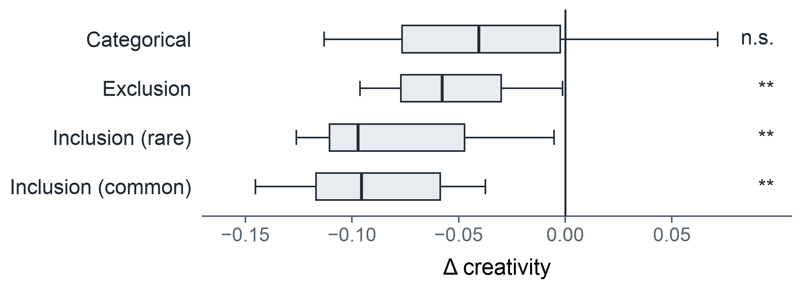

# Constraints and creativity: what each constraint type does to a model's paths

**2026-07-22 · kg_creat track · Regime A · 8 models × 30 fixed endpoint bundles**

Creativity is novelty *and* utility — a remote artifact that is also fit for the requirement. In
this benchmark the constraints *are* the utility requirement: to be useful, a path from `u` to `v`
must be factual, well-formed, and satisfy a semantic/structural constraint. So the study has one
dependent variable, creativity `E[R·U]`, and one independent variable, constraint type. This report
walks the result almost entirely through concrete paths the models actually produced.

The constraint set is **four types**: categorical, exclusion, and inclusion in two variants (common
and rare relation class). A fifth type — ordering — was piloted and **dropped**; as we derived it,
it was confounded by construction and did not measure sequencing (Appendix A).

Every cell is administered on the **same 30 endpoint pairs**, so within a pair only the constraint
changes and every comparison below is a model differenced against itself.

---

## 1. One endpoint pair, five cells

Here is Claude Sonnet 4.6 on the single pair **Japan → United Nations**, one path per cell. This is
the whole experiment in miniature — the endpoints never move; only the demand does.

| cell | constraint | path | verdict |
|---|---|---|---|
| baseline | *(none)* | japan —[represented by]→ Kōichirō Matsuura —[director-general of]→ UNESCO —[specialized agency of]→ UN | ✓ |
| categorical | through a kind of *international organization* | japan —[member of]→ WHO —[specialized agency of]→ UN | ✓ |
| exclusion | avoid *membership* relations | japan —[hosts headquarters of]→ UN University —[chartered by]→ UN | ✓ |
| inclusion (rare) | use an *international-relations* relation | japan —[hosts headquarters of]→ UN University —[chartered by]→ UN | ✓ |
| inclusion (common) | use a *location-or-origin* relation | japan —[joined]→ UN —[headquartered in]→ New York City | ✗ structural |

The inclusion failure is already instructive: the model bolts the required relation on at the end
(`… —[headquartered in]→ New York City`) and in doing so **runs off the target**, never reaching the
UN. It foreshadows the aggregate finding — models satisfy a required class by appending it, often at
the cost of the path itself.

---

## 2. Creativity falls under every constraint, by different amounts



Each box is the 8 per-model paired effects (constrained − unconstrained, same endpoints); stars are
a one-sample t-test on those 8 values, Holm-corrected.

| cell | creativity `E[R·U]` | vs baseline | utility `U` | novelty of useful paths `R_valid` | sig. |
|---|---|---|---|---|---|
| baseline | 0.201 | — | 0.484 | 0.420 | |
| categorical | 0.168 | −16 % | 0.360 | 0.465 | n.s. |
| exclusion | 0.147 | −27 % | 0.326 | 0.458 | ** |
| inclusion (rare) | 0.121 | −40 % | 0.266 | 0.463 | ** |
| inclusion (common) | 0.109 | −46 % | 0.254 | 0.424 | ** |

Every constraint lowers creativity, and the three relation-class constraints do so significantly and
consistently across models. Categorical, at the other end, is the only cell whose effect the 8 models
do not agree on — mean negative but not distinguishable from zero, because two models actually *gain*
(§6).

Notice what the `R_valid` column says: the paths that *do* succeed under a constraint are on average
*more* novel than baseline successes (0.42 → 0.45–0.46). Constraints push models off their default,
low-remoteness routes. The cost is not that successful paths get boring — it is that far fewer paths
succeed. Creativity falls because utility falls, not because novelty does.

---

## 3. Two ways a model fails a constraint

Restricting to **constraint-channel** failures (factual, well-formed paths that just miss the
requirement), two behaviours recur across every constraint type.

### (a) The minimal edit — change a word, not the path

The model keeps its default path and tweaks a single surface token, which does not move the
underlying relation into (or out of) the target class.

**Haiku 4.5 · UK → Paul McCartney · *avoid all participation relations***
```
✓ unconstrained:  united kingdom —[is home to]→ the beatles —[member]→ paul mccartney
✗ constrained:    united kingdom —[is home to]→ the beatles —[included member]→ paul mccartney
```
It edited the *second* hop (`member` → `included member`) and left the forbidden `is home to`
untouched — changing the one relation that was already fine.

**Sonnet 4.6 · Japan → UN · *use an international-relations relation***
```
✓ unconstrained:  japan —[contributes to]→ un peacekeeping ops —[operated by]→ united nations
✗ constrained:    japan —[contributes to]→ un peacekeeping ops —[administered by]→ united nations
```
`operated by` → `administered by`. One synonym swapped; the required class never appears.

**Haiku 4.5 · Germany → Australia Group · *use a location-or-origin relation***
```
✓ unconstrained:  germany —[is member of]→ nuclear suppliers group —[coordinates with]→ australia group
✗ constrained:    germany —[member of]→ nuclear suppliers group —[coordinates with]→ australia group
```
`is member of` → `member of`. Functionally the identical path; the constraint is simply ignored.

### (b) The clean rebuild — a different path that still doesn't satisfy the demand

The model *does* produce a new, perfectly factual path that nonetheless misses the constraint.

**Gemini 2.5 Flash · US → UK · *avoid all location-or-origin relations***
```
✓ unconstrained:  united states —[colonized by]→ great britain —[historical entity]→ united kingdom
✗ constrained:    united states —[founded by]→ thirteen colonies —[formerly part of]→ united kingdom
```
Completely rebuilt — and its first hop `founded by` is itself a location-or-origin relation, so the
rebuild reintroduced exactly the class it was told to avoid.

**Sonnet 4.6 · Brazil → Golden Globe Awards · *avoid all participation relations***
```
✓ unconstrained:  brazil (film) —[directed by]→ terry gilliam —[directed]→ the fisher king —[nominated for]→ golden globe awards
✗ constrained:    brazil (film) —[starred]→ jonathan pryce —[starred in]→ evita —[won]→ golden globe awards
```
A rebuilt cast-based path — and its final hop `won` is a participation relation, so again the rebuild
reintroduced the forbidden class.

---

## 4. Constraints do not make models hallucinate — they defeat compliance

If constraints pushed models past the edge of their knowledge, we'd see the **factual** failure
channel swell under constraint. It does not: factual failures sit at a flat ~32–37 % in every cell,
*including the unconstrained baseline* (32.3 %). Hallucination is a roughly constant background tax,
not a constraint effect. The entire *added* cost of a constraint lands in the **constraint** channel
(7.9 % categorical → 15.5 % rare-inclusion), and those constraint-channel failures are typically
paths that are factually fine.


That baseline factuality floor is real and worth seeing — these are *unconstrained* paths the judge
rejected as hallucinated:

**Haiku 4.5, baseline:**
```
united states —[is home to]→ princeton university —[employed]→ albert einstein
   ✗ flagged: 'princeton university —employed→ albert einstein'
   (Einstein was at the Institute for Advanced Study in Princeton, not employed by the university)
```
```
united states —[produced]→ the beatles —[originated from]→ liverpool —[located in]→ united kingdom
   ✗ flagged: 'united states —produced→ the beatles'
```
**Llama 3.1 8B, baseline:**
```
united states —[founded]→ princeton university —[alumnus]→ albert einstein
   ✗ flagged both hops: the US did not found Princeton; Einstein was not an alumnus
```

None of these is a constraint failure — they are ordinary factual errors that occur at the same rate
whether or not a constraint is present.

---

## 5. Categorical is the one constraint that can *raise* creativity

Categorical is the only cell where naming the constraint sometimes produces a *more* creative path
than the model's own unconstrained answer — and the effect is real enough to flip 2 of 8 models
(Sonnet 4.6, GPT-4.1-mini) above their baseline. Being told to route through a *type* of entity
redirects the search without restricting the relations used to build the path.

**Sonnet 4.6 · US → UK · *pass through a kind of 'human'***
```
baseline (R 0.38):    us —[founded by]→ george washington —[fought against]→ british army —[serves]→ uk
categorical (R 0.58): us —[birthplace of]→ sylvia plath —[married]→ ted hughes —[poet laureate of]→ uk
```
The type requirement pulled the model off the obvious founding-war route and onto a literary one —
Plath (American) married Hughes (UK poet laureate). More novel *and* satisfying: creativity up.

**Sonnet 4.6 · US → Albert Einstein · *through a kind of 'social state'***
```
baseline:     us —[hosted institution]→ institute for advanced study —[employed]→ albert einstein
categorical:  us —[recognized state]→ israel —[offered presidency to]→ albert einstein
```
The unusual fact that Israel offered Einstein its presidency surfaces *because* the type constraint
forced an intermediate the default path had no reason to visit.

**GPT-4.1-mini · Japan → UN · *through an international organization***
```
baseline (R 0.27):    japan —[hosted]→ un university —[operates under]→ un
categorical (R 0.48): japan —[member of]→ OECD —[observer at]→ un general assembly —[main organ of]→ un
```

Contrast this with what the *relation-class* constraints do (§3): those restrict the vocabulary the
model builds with, and models respond by minimally editing or abandoning good paths. Categorical
constrains the *waypoint* and leaves the machinery free — which is why it is the one constraint that
occasionally helps rather than hurts.

---

## 6. Caveats, with examples

**Judge borderline cases concentrate in the categorical cell** — which is exactly why the owed human
reliability pass matters most there:
```
Sonnet 4.6 · Brazil → Hitchcock · through a 'superpower'
   brazil —[diplomatic relations with]→ france —[awarded légion d'honneur to]→ alfred hitchcock
   → Is France a "superpower"? The verdict decides the cell.
Gemini 2.5 Flash · Germany → UN · through an 'international organization'
   germany —[host country for]→ un campus bonn —[site of]→ un volunteers —[program of]→ un
   → 'UN Volunteers' is a UN programme; rejecting it is defensible but not obvious.
```

**Exemplar noise.** Constraints show four data-derived exemplars, and some do not fit their cluster's
name: the *international-relations* class was presented with `"country"` as an exemplar,
*location-or-origin* with `"established"`, *membership* with `"signed"`. This is grading-consistent
(the judge sees the same class name and exemplars the model saw), but a cell's difficulty partly
reflects how coherent its cluster happened to be.

**Ambiguous endpoints weaken the pairing for ~3 of 30 bundles.** Because we strip disambiguating
parentheticals, different *senses* of a label can both count as the endpoint. In bundle A11 models
resolved "Brazil" as both the country and the 1985 Gilliam film across cells. For those bundles "same
endpoints" does not strictly hold; it adds noise, not directional bias.

**A scorer bug the examples caught.** An earlier `_entity_matches` used bidirectional substring
matching, so a path ending at `australia group export controls` counted as reaching `Australia
Group`. 6.4 % of well-formed paths had inexact endpoints, ~81 % genuinely the wrong entity. Fixed to
require equality up to a trailing parenthetical; re-deriving offline moved 313 paths (4.4 %) and
changed no conclusion. All numbers here are the strict re-derivation.

---

## Summary

- **Creativity falls under every constraint**, from −16 % (categorical, n.s.) to −46 % (common
  inclusion, `**`), across 8 models.
- **The cost is compliance, not knowledge.** Factuality is a flat ~32–37 % background tax; the added
  cost of a constraint is entirely in the constraint channel.
- **Successful paths under a constraint are *more* novel, not less** (`R_valid` 0.42 → 0.46).
  Creativity falls because utility falls.
- **Models fail constraints two ways**: minimal surface edits that don't move the underlying relation,
  and clean rebuilds that reintroduce (or never reach) the target class.
- **Categorical can raise creativity** (2/8 models) because it constrains the waypoint, not the
  relation vocabulary — the Sylvia-Plath route is more novel *and* valid than the model's default.

Cost of the run: ~$6.6. Owed: human judge-reliability pass (load-bearing for the categorical cell),
and running the reframed single-stimulus blending task at scale.

---

## Appendix A — why ordering was dropped

Ordering (a relation of class A must appear *before* one of class B) looked, in a first pass, like the
single most damaging constraint: an 86 % creativity collapse. On inspection that number is a
construction artifact, not a measure of sequencing ability, and we removed the constraint rather than
report a confounded result. Three problems, all downstream of how the target was derived — as the
**reverse** of each bundle's most-common class ordering:

1. **It is a conjunction, not an ordering.** Only ~12 % of unconstrained paths contain *both* target
   relation classes at all. "Both classes, in any order" already caps success near 12 % before
   ordering is even considered — so most of the difficulty is double-inclusion, not sequence.

2. **The demanded direction fights the factual structure.** Of the baseline paths where both classes
   *do* co-occur, **89 % are in the reverse (natural) order and only 11 % in the order we demanded.**
   By setting the target to the reverse of the natural ordering, we asked for the direction the
   entities' real relationships mostly do not support.

3. **Sometimes outright infeasible.** For **8 of 30** bundles, *zero* of the 8 models ever produced a
   satisfying path, and the demanded order appears in ~0 % of free baseline paths there. On fixed
   real-world `(u, v)`, the anti-natural order may simply not exist in the graph.

Decomposing the 495 ordering failures confirms it: only **11.5 %** are genuine order inversions; 88 %
never get both classes into the path. Models *do* respond to the instruction — they produce the
demanded order in 5.6 % of constrained paths vs 1.4 % of free baseline paths, ~4× more — but against a
target stacked against them by construction.

A clean ordering constraint is recoverable (derive the target as the *natural* order, and add a
"both classes, any order" control to separate conjunction cost from sequence cost), but that is a
future re-derivation. As administered here, ordering does not measure what its name implies, so it is
excluded from the constraint set above.
