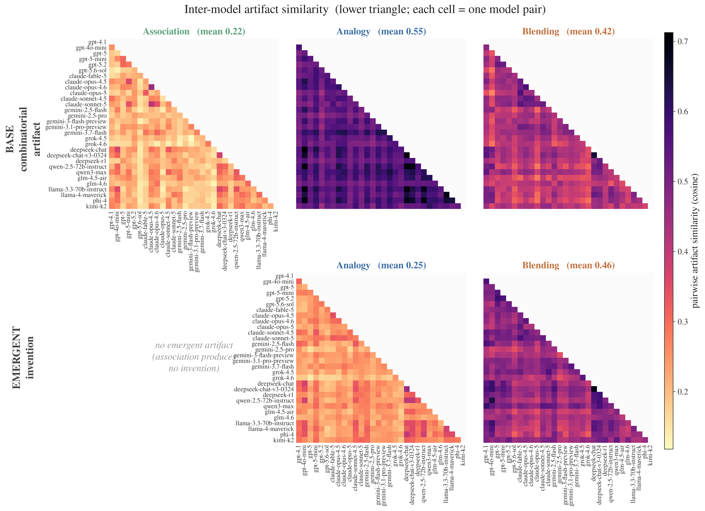

# The artificial hivemind: where LLMs converge, and where they don't

**2026-08-31 · Kombine (kg_creat) · analysis #2 — cross-model artifact homogeneity**

Given the same two entities, 18 language models each connect them (association), draw an analogy and
invent a concept, or blend them. How similar are the artifacts they produce — independent of who scores
highest? Because the tasks are structurally different, we separate two levels of artifact:

- **Base artifact** (all three tasks): the object that utility/surprise/originality actually score —
  the association *bridge* (path minus its fixed anchors), the analogy *mapping* (both domain paths),
  the blend's *generic space g* (the shared schema).
- **Emergent invention** (analogy and blending only): the newly invented concept — the analogy's *h*
  (name + projected image) and the blend's *c′* (concept + blended structure + elaboration). Association
  produces no invention, so it is absent from this view.

Convergence for an anchor pair = `1 − mean pairwise cosine distance` among the models' artifacts,
compared against a null that re-draws same-sized groups *across* items (breaking per-item alignment).
Local embeddings only; no judge or API calls.

## Claims

1. **The base structure is convergent where it is anchor-bound; the *invention* is where diversity
   lives.** The analogy *mapping* is the single most convergent artifact in the study (0.55) — it is
   essentially facts about u and v, which models retrieve alike. The *abstraction* artifacts (the
   association bridge, the blend's generic space) are less convergent (0.22, 0.42): finding a route or a
   shared schema leaves models more freedom. But when the model must *invent* a concept, the two
   invention tasks split — the analogy invention is the most divergent artifact of all (0.25), while the
   blend *c′* homogenizes (0.46). Blending converges even on its creative leap; analogy does not.
2. **A convergence ladder across each task's characteristic creative product: association → analogy →
   blending.** Taking what each task is *for* — the bridge (0.22), the analogy invention (0.25), the
   blend *c′* (0.46) — inter-model agreement rises monotonically (excess over chance +0.14 → +0.16 →
   +0.32). The more the task demands a single coherent combination, the more independent models land on
   the same one; blending is a near-hivemind, association the divergent floor.
3. **Blends carry a provider "house style"; bridges and analogy inventions do not.** In blending, same-
   provider model pairs are more alike than cross-provider pairs (0.50 vs. 0.46), visible as the dark
   OpenAI block in Figure 1; for the association bridge and the analogy invention the gap is negligible.

*Figure 1. Lower-triangular model×model artifact similarity (30 models, lab-grouped, shared colour
scale). **Row 1 (base)**: association bridge / analogy mapping / blend generic space. **Row 2
(emergent)**: analogy invention *h* / blend *c′* (association has none). The base analogy mapping is
darkest (models converge on anchor-facts); the emergent analogy invention is palest (they diverge when
inventing); blending stays warm in both, with a visible OpenAI block.*

## Method

- **Pool.** 30 models (6-model pilot + 13 frontier additions + 9 cheaper models added 2026-09-05; mistral-large dropped for sparse
  elicitation). 30 anchor pairs per task, one artifact per (model, item).
- **Two artifact representations.** *Base* — association: bridge (intermediate concepts + relations,
  anchors removed); analogy: `path_a ∪ path_b`; blending: the generic space `g` (textual schema).
  *Emergent* — analogy: `invention` + projected image triples; blending: `concept` + full blended
  structure + emergent. Each embedded with the scoring MiniLM model.
- **Convergence & null** as above; excess over the null is what "hivemind" means. Model×model
  similarity (Figure 1) is mean per-item cosine similarity between each model pair.

## Results

| View | Task | Convergence | Chance | Excess |
|------|------|:-----------:|:------:|:------:|
| **Base** | Association (bridge) | 0.216 | 0.079 | +0.14 |
| | Analogy (mapping) | **0.553** | 0.149 | +0.40 |
| | Blending (generic space *g*) | 0.422 | 0.187 | +0.24 |
| **Emergent** | Analogy (invention *h*) | 0.253 | 0.097 | +0.16 |
| | Blending (*c′*) | **0.462** | 0.143 | +0.32 |

**Base vs. emergent (claim 1).** The analogy *mapping* is the most convergent artifact (0.55) — two
lists of facts about u and v, retrieved alike. The abstraction artifacts (association bridge, blend
generic space) sit lower (0.22, 0.42): a route or a shared schema leaves room to differ. Then the
invention step splits the two tasks — analogy inventions are the most divergent of the five (0.25),
blend *c′* the second most convergent (0.46). Blending homogenizes on its creative leap; analogy keeps
its inventive diversity.

**The ladder (claim 2).** Bridge (0.21) → analogy invention (0.24) → blend *c′* (0.48): a monotone rise
in inter-model agreement across each task's characteristic product. This operationalizes "increasing
demand for convergent thinking" — association admits many valid bridges (models scatter), blending
essentially one obvious fusion (models converge). *Caveat: these are different object types (a path vs.
an invented concept), so the ladder is a claim about relative agreement on each task's own product, not
a like-for-like metric.*

**House style (claim 3).** Same-provider vs. cross-provider invention similarity is 0.52 vs. 0.47 for
blending (base generic space 0.45 vs. 0.40) — the OpenAI models cluster tightly (the dark top-left block
in Figure 1). For association and analogy inventions the gap is ~0.02. A model's *blend* carries a
family fingerprint; its *bridge* and *analogy invention* do not. (Descriptive; the aggregate gap is
untested.)

**Concrete extremes (emergent).** Blends the pool converges on: *Roman Empire + Crystals*,
*Photosynthesis + Bread*. Blends that split it: *Existentialism + Enlightenment*, *Frida Kahlo + Bob
Dylan*. Analogy inventions converge most on *Vaccines ∷ Ethics*, least on *Oak tree ∷ Chess*.

## Limitations / red-team

- **Metric dependence.** Convergence is one embedding space (MiniLM); absolute values are not meaningful
  alone — the null baselines and the cross-condition comparisons carry the claims.
- **Object types differ.** The base row compares a path, a mapping, and a schema; the ladder (claim 2)
  compares a path to an invented concept. Both are framed as *relative* agreement, not a shared metric.
  Anchors are stripped from the association bridge to avoid endpoint inflation.
- **n = 30 items; single-draw null.** The excesses over chance are large, but a bootstrap would give a
  CI, and the lab-family gap (claim 3) is untested.
- **Post-hoc/exploratory.** Claims are read off the outputs after the fact; claims 1–2 rest on large
  effects, claim 3 is descriptive.

## Sample frame

30 models × 30 anchor pairs × {base: 3 tasks, emergent: 2 tasks}, one artifact per cell; complete-case
per item requires ≥ 3 valid artifacts. Anchors are the fixed Kombine item set
(curated, domain-balanced, cross-domain). Data:
`data/kg_creat/kombine_test30/analysis/invention_homogeneity.json`. Reproduce:
`analyze_invention_homogeneity.py` → `plot_hivemind.py`.

## Next

The 30-model re-score unlocks analyses #1 (association-as-proxy dissociation) and #3 (anchor properties
that predict *high-scoring* — surprising/original — inventions).
