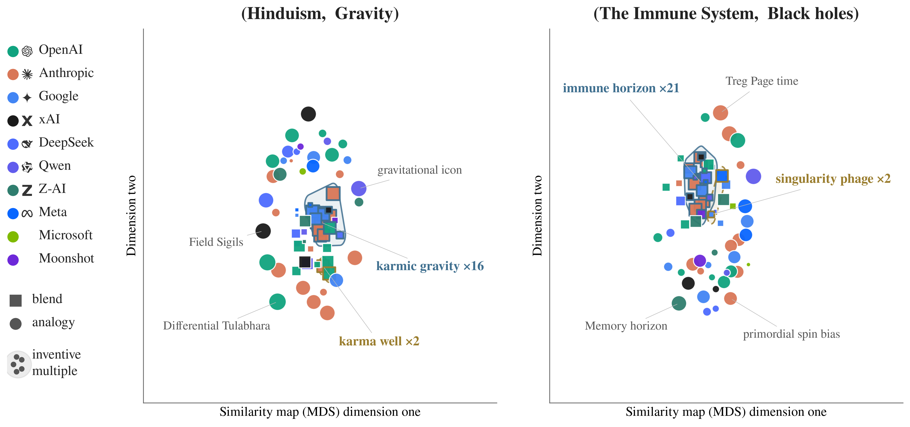
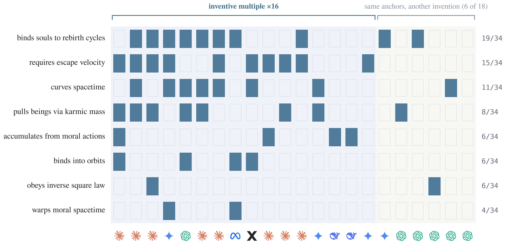

# Inventive Multiples in Kombine

*2026-09-01, redone 2026-09-05 on the 30-model pool with the name-free criterion · kg_creat track · analysis memo*

**Question.** In the history of science, *multiples* are near-identical discoveries made independently by different people in the same period. Kombine lets us ask the model analogue: given the same anchors `(u, v)`, how often do two independent models invent the *same* new entity, and what predicts it? We call such a pair an **inventive multiple**.

**What changed since the last version.** Two things. The criterion is now **name-free and property-based** — a multiple is two inventions that *assert the same properties*, with the coined name excluded from the measurement entirely and held back as an independent check. And the pool grew from 21 to 30 models, so every rate below is recomputed over 25,321 co-response pairs rather than 12,383.

## Claims

1. **Models reinvent the same entity, and the convergence is shallow but real.** Two independent models assert at least two of the same properties *and* share an abstraction in **1.6%** of co-response pairs; sharing a single property reaches 8.0%. Coining the identical name is almost no evidence of it: of the 559 pairs that coined the *same name*, only **7%** are multiples.
2. **The operator sets the rate.** Blending produces **12×** more multiples than analogy (3.0% vs 0.2% of pairs; paired Wilcoxon p = 1.7×10⁻⁶), and the encoder-free name-match cut agrees (4.2% vs 0.2%, p = 3.5×10⁻⁶).
3. **Model kinship drives convergence.** Two models from the same provider family form a multiple **2.6×** as often as a cross-family pair (3.5% vs 1.4%; permutation p = 5×10⁻⁴) — an artificial-hivemind effect within lineages.
4. **Forcing a genuine shared slot halved the deep convergence and left the shallow part alone.** Like-for-like on the 21 models that were re-elicited, the `uv` format leaves name agreement unchanged (4.6% → 4.7%) while structural agreement drops by half (6.3% → 3.1%). Some of the old deep agreement was the concatenation habit, not shared invention.

## What counts as a near-identical invention

The measurement never sees a name. Every triple of an invention is reduced to **"relation object"** — the coined name is the subject of all of them, so dropping it turns the comparison into what a model *says about* its invention rather than what it *calls* it. A pair of inventions (same task, same anchor pair) is graded at three nested levels:

| Level | Criterion | Reading |
|---|---|---|
| **Nominal** | coined names match (normalized, order-independent word set) | same label — reported only as a check, never as an input |
| **One property** | ≥1 property matched at cosine ≥ 0.58, one-to-one | one thing in common |
| **Structural** | **≥2** properties matched **and** the abstraction (projected source φ / generic space g) at cosine ≥ 0.50 | same invention, reached the same way |

The **structural** level is the headline. Properties are matched **one-to-one** by greedy assignment, so a single generic property cannot match several at once. κ = 2 ("the same properties", plural — one alone is easily supplied by the anchors), τ₁ = 0.58 for a property match, τ₂ = 0.50 for the abstraction.

**The name is the held-out check, not a trigger.** Because naming plays no part in the criterion, name agreement can be used to validate it. Pairs that coined the identical name re-use **0.68** properties on average against **0.26** for the rest, and 45% of them clear the abstraction bar against 20% — so the criterion tracks naming without being driven by it. But the two come apart in the direction that matters: only 7% of same-name pairs are multiples. **Naming convergence and structural convergence are related but distinct, and only the latter is measured here.**

We also tried an explicit *relational* match (Jaccard over the relation labels themselves). It is unusable as a hard criterion: even name-identical inventions have relation-Jaccard ≈ 0 (median 0, mean 0.05, n = 559), because the relation vocabulary is open — models assert the same property through different predicates. That is exactly why properties are matched by embedding rather than by string, and it is itself part of Claim 1.

## Data

**Sample frame.** 30 models × 30 anchor pairs × 2 tasks (analogy, blending). One invention per model per (task, anchor pair): **1,773 inventions, 25,321 pairs of models responding to the same task and anchors**. One draw per model at T = 0.9. Findings describe *these* models on *these* anchor pairs, not models or anchors in general.

## How often (Claim 1)

| Level | Pairs | Rate |
|---|---|---|
| Nominal (same name) | 559 | 2.2% |
| One property shared | 2,026 | 8.0% |
| **Structural (same invention, same way)** | **408** | **1.6%** |

Requiring a second property and a shared abstraction removes four fifths of the one-property matches. Read per invention rather than per pair, **1 in 4 invented concepts (432 / 1,773, 24%) is reinvented by at least one other model** — 44% of blends against 5% of analogy inventions. Convergence is often many models, not two: 42 of 60 (task, anchor) settings have ≥1 multiple, **109** distinct inventions are rediscovered, and cluster sizes reach **28 of 30 models**.

| Anchors | Task | Models | Families | Representative names |
|---|---|--:|--:|---|
| Opera + Documentary film | blend | 28 | 9 | Docera, Docu-Opera, Opera Verité |
| Democracy + Banking | blend | 17 | 8 | Civic Bank, Civic Reserve, Liquid Franchise |
| Frida Kahlo + Bob Dylan | blend | 17 | 8 | Artivist, Emblematic Balladeer, Painted Balladeer |
| The immune system + Black holes | blend | 15 | 7 | Immune Horizon, Immuno-void, defensive singularity |
| The oak tree + Chess | blend | 14 | 8 | Arboreal Gambit, Chessgrove, Oak Chess |
| Photosynthesis + Bread | blend | 14 | 7 | Solar Loaf, Photobread, Helio-Loaf |
| Vaccines + Ethics | blend | 11 | 5 | Moral Inoculation, ImmunoEthic, Moral Immunome |
| Christianity + Beauty | blend | 11 | 6 | Sacred Aesthetic, Iconic Devotion, Redeeming Beauty |

Note what the name-free criterion buys here: the 28-model *Opera + Documentary film* cluster spans nine provider families and six different names, and it is one multiple because the models assert the same properties, not because they agree on a label.



*Figure 1. Every model's invention for two anchor pairs; shape = task, colour = provider, size = composite emergent creativity. Shaded regions are inventive multiples, one hue per cluster, labelled with the shared invention and the number of models. Positions come from metric MDS on the cosine distance between asserted properties — the same quantity the criterion uses — with distances inside a multiple scaled by 0.55 so a cluster reads as one group rather than a transitive chain (normalized stress 0.29 on both panels). No other distance is altered.*



*Figure 2. The (Hinduism, Gravity) multiple as a model × property matrix: rows are the properties its 11 members re-use however each is worded, a filled cell marks a model asserting one, and the right-hand block is six of the 18 models that saw the same anchors and built something else.*

## What predicts convergence (Claims 2–3)

Pairs are not independent (each model is in many pairs), so we test with methods that respect that.

- **Task (dominant).** Per anchor pair, the blend rate exceeds the analogy rate in almost every case: **3.0% vs 0.2%** (n = 30 anchor pairs, paired Wilcoxon **p = 1.7×10⁻⁶**). The encoder-free nominal cut gives the same result: 4.2% vs 0.2% (**p = 3.5×10⁻⁶**). Fusing two fixed anchors admits only a few natural inventions; projecting a *freely chosen* source across a mapping does not, so analogy stays divergent.
- **Model kinship.** Same-provider pairs are multiples **3.5%** of the time vs **1.4%** for cross-provider pairs — a 2.6× relative risk. A permutation test reshuffling the provider label across the 30 models (preserving pair structure) gives **p = 5×10⁻⁴**.
- **Originality.** Multiple-member inventions are less original than singletons (0.43 vs 0.47) — the rediscovered inventions are the more obvious ones.

**Which clause keeps the non-members out — and what that says about anchors vs models.** For every cluster, the models that answered the same item without joining it (2,794 (cluster, outsider) relations in all) can fail either clause. **1,119 fail only the property clause** — their abstraction is within the bar, sometimes well above the cluster's own internal agreement — against **153** that fail only the abstraction clause and 1,522 that fail both. On items like (The immune system, Black holes) the schema is close to forced by the anchors: every model writes some version of *a boundary that irreversibly captures whatever crosses it*, and they part company over what they build on it. So the two clauses answer different questions: **agreement on the abstraction is substantially an anchor property, while agreement on the asserted properties is the model's.** The criterion requires both, which is why it is the headline.

**Sensitivity.** The multiple rate (overall / blending / analogy, in %) across the grid of κ (properties required) and τ₂ (abstraction bar):

| κ \ τ₂ | 0.45 | 0.50 | 0.55 |
|---|---|---|---|
| **≥1** | 10.5 / 17.9 / 3.2 | 8.0 / 13.6 / 2.5 | 5.5 / 9.2 / 1.9 |
| **≥2** | 2.1 / 3.9 / 0.3 | **1.6 / 3.0 / 0.3** | 1.2 / 2.1 / 0.2 |
| **≥3** | 0.3 / 0.5 / 0.0 | 0.2 / 0.5 / 0.0 | 0.2 / 0.3 / 0.0 |

Absolute rates move with the thresholds, as they must; blending exceeds analogy at every cell, and the convergence stays shallow — requiring a third shared property nearly extinguishes it.

## Anchor distance: not a finding

On the pre-`uv` blends, more distant anchors raised the blend multiple rate (ρ = +0.45, p = 0.013). On the current data it does not survive.

| Operator | Spearman | Pearson | Leave-one-out | Rate by distance tercile (near → far) |
|---|---|---|---|---|
| **Blending** | ρ = +0.24 (p = 0.20) | r = +0.29 (p = 0.12) | 0/30 deletions reach p < 0.05 | 2.7% → 2.3% → 4.1% |
| **Analogy** | ρ = −0.19 (p = 0.31) | r = −0.00 (p = 0.99) | 0/30 deletions reach p < 0.05 | 0.3% → 0.1% → 0.3% (flat) |

The unit is the anchor pair (n = 30), run separately per task. Blends still converge most on the farthest third, but nothing survives leave-one-out, so this is **not reported as a finding**. What does survive without qualification is the level difference (Claim 2): analogy is a fan at every distance.

## What the `uv` re-elicitation changed (Claim 4)

Blending only, identical pipeline both sides, **restricted to the 21 models that have a pre-v3 backup** so the format change is not confounded with the pool change (`--prepost`):

| | pairs | nominal | ≥1 property | structural | clusters (max) | same/cross provider | distance ρ |
|---|--:|--:|--:|--:|---|---|---|
| **pre-`uv`** | 6,280 | 4.6% | 17.0% | 6.3% | 52 (18) | 14.3% / 5.0% | +0.45 (p = .013) |
| **post-`uv`** | 6,300 | 4.7% | 14.7% | **3.1%** | 65 (21) | 6.9% / 2.5% | +0.34 (p = .066) |

Name agreement is unchanged; deep agreement halves, and the number of distinct clusters *rises* (52 → 65) as models split onto different shared structures instead of converging on one. Asking for a slot both inputs organize makes models commit to *which* shared structure they mean, and they do not all pick the same one. This cuts both ways for the benchmark: the earlier convergence numbers were partly a format artifact, and the format fix is what exposed it.

## Examples

Full members of every cluster — each invention with its generic space (blend) or projected source (analogy) and its tagged structure — are generated from the analysis output, not typed:

- [`examples_section.md`](examples_section.md) — the largest cross-family clusters, in markdown.
- [`multiples_showcase.html`](multiples_showcase.html) — all 109 clusters, browsable.

Both are regenerated by `make_multiples_showcase.py`, so they cannot drift from the numbers above.

## Limitations and red-team

- **Convergence being shallow is the load-bearing finding, and it is robust to the definition.** As the bar rises (one property → two → three) the rate falls to near zero at every τ₂ in the grid.
- **The name check cuts against a tempting shortcut.** Only 7% of same-name pairs are multiples, so any measure that treated a shared name as evidence of a shared invention would be wrong about 93% of the time.
- **Provider ≠ architecture.** The permutation test controls the rate under label reshuffling, but same-provider models also share size and era, so "kinship" is training-lineage similarity broadly.
- **Single encoder.** Property matching rests on one embedding model (`all-MiniLM-L6-v2`, local); the nominal cut is encoder-free and agrees on direction.
- **The distance effect is not established** (p = 0.20, fails leave-one-out) and is reported as a null.
- **The pool is not a random sample of models.** 30 models spanning ten providers, chosen for availability and coverage; the 9 added in this round are cheaper and weaker, which shifts rates that depend on model strength.
- **Scope.** 30 anchor pairs, one draw per model (T = 0.9), 30 models. Rates are specific to this pool.

## Reproduce

```
.venv_mlx/bin/python -m src.kg_creat.scripts.embed_inventions            # invention vectors (after any re-elicitation)
.venv_mlx/bin/python -m src.kg_creat.scripts.analyze_inventive_multiples # levels, calibration, predictors, sensitivity
.venv_mlx/bin/python -m src.kg_creat.scripts.analyze_inventive_multiples --prepost   # the pre/post table
.venv/bin/python -m src.kg_creat.scripts.make_multiples_showcase         # examples_section.md + showcase HTML
.venv/bin/python -m src.kg_creat.scripts.plot_invention_landscape        # Figure 1
.venv/bin/python -m src.kg_creat.scripts.plot_multiples_matrix           # Figure 2
.venv/bin/python -m src.kg_creat.scripts.make_paper_multiples_figure     # the stacked figure the paper includes
```

The analysis reads `data/kg_creat/kombine_test30/analysis/invention_vectors.npz` and the projected-source / generic-space concepts from the response files, and writes every number quoted here to `data/kg_creat/kombine_test30/analysis/inventive_multiples.json`. The pre/post mode reads the `responses.json.bak_pre_blendv3` backups and fails loudly if they are missing.
