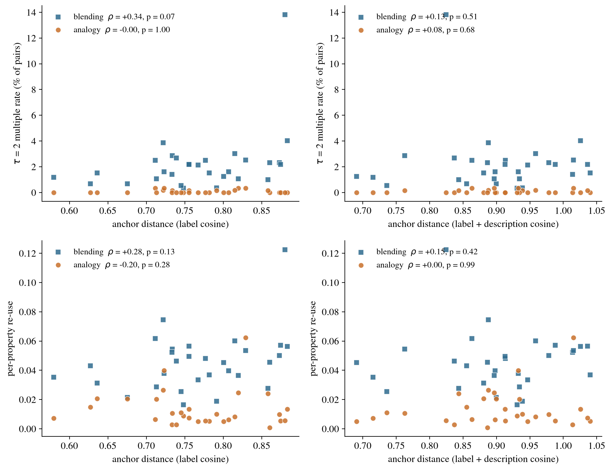

# Inventive Multiples in Kombine

*2026-09-01, redone 2026-09-09 on the 35-model pool with the τ-criterion · kg_creat track · analysis memo*

**Question.** In the history of science, *multiples* are near-identical discoveries made independently by different people in the same period. Kombine lets us ask the model analogue: given the same anchors `(u, v)`, how often do two independent models invent the *same* new entity, and what predicts it? We call such a pair an **inventive multiple**.

**What changed since the last version.** Four things, each of which moved a headline number.

1. **The criterion is property overlap and nothing else.** The abstraction clause (a shared generic space or projected source) is gone; it was a second claim riding on the first. The abstraction is still computed and shown, never used.
2. **τ is the reported axis**, not a hidden constant: a *τ-inventive multiple* re-uses at least τ properties, and every rate is given at every τ the data supports. The prose quotes τ = 2.
3. **θ is set where matches read as paraphrases.** The property-match cosine is 0.674, chosen by inspecting matched pairs: above about 0.65 two properties are the same claim in other words; between 0.50 and 0.60 the encoder is anchored on one shared noun. A cross-item null reports what the bar implies (α = 0.03%). An earlier 0.545 was the null's 99.75th percentile and admitted the shared-noun matches.
4. **Anchor echo is removed.** A property whose object *is* one of the anchors (`(X, resembles, Pi)` on *(Don Quixote, Pi)*) is supplied by the item, not invented, and it is 8.7% of what analogy inventions assert. Filtering it cuts the analogy rate by 2.6× and is the single biggest change to the blend/analogy comparison.

And the pool grew from 30 to 35 models, so every rate is recomputed over 34,687 co-response pairs.

## Claims

1. **One in five inventions is re-invented by another model, and the convergence is shallow.** At τ = 2, 1.1% of co-response pairs are multiples and **20%** of inventions are in at least one (37% of blends, 3% of analogy inventions). Requiring three shared properties leaves 30 pairs in the whole benchmark.
2. **Blends produce multiples 27× as often as analogies at fixed τ, and 2–3× as often per property.** The fixed-τ ratio is mostly that blends assert twice as many properties. Normalised per property the advantage is **3.3×** (paired Wilcoxon p = 5×10⁻⁸); with verbatim, encoder-free matching **2.0×** (p = 1.5×10⁻³).
3. **Models from the same provider form multiples 2.5× as often** as cross-provider pairs (2.3% vs 0.9%, permutation p = 5×10⁻⁴), within each task and on the per-property route too.
4. **Naming and inventing come apart in both directions.** 68% of the 753 same-name pairs share no property, and only 6% are multiples; 89% of the 395 multiples carry different names, and within components 412 member inventions carry 349 distinct names.
5. **Clusters are chains, not consensus.** The largest component links 19 of 35 models on *(Opera, Documentary film)*; 42% of its member pairs are multiples themselves, and 17–25% in the next seven (mean over all 112 clusters: 78%).

## What counts as a near-identical invention

The measurement never sees a name. Every triple of an invention is reduced to **"relation object"** — the coined name is the subject of all of them, so dropping it turns the comparison into what a model *says about* its invention rather than what it *calls* it. Two properties are *the same* when the cosine between their `all-MiniLM-L6-v2` embeddings is ≥ θ = 0.674; properties are matched **one-to-one** (an exact maximum matching on the threshold graph), so a single generic property cannot satisfy several; and a pair of inventions (same task, same anchor pair) is a **τ-inventive multiple** when at least τ properties match.

**Two exclusions, both because the text is supplied by the item.**

- The invention's own **name**, the subject of every triple it asserts.
- **Anchor echo**: any property whose object, normalised, is one of the two anchors. Exact match on the object, not word overlap — `emits light` on *(Mount Everest, The light bulb)* is a real property and survives.

| Task | Properties per invention (raw → filtered) | Anchor-echo properties | Inventions left with < 2 properties | τ = 2 rate (raw → filtered) |
|---|---|---|---|---|
| Analogy | 2.60 → 2.37 | 234 / 2,692 (**8.7%**) | 214 / 1,037 (21%) | 0.25% → **0.08%** |
| Blending | 5.01 → 5.00 | 14 / 5,176 (0.3%) | 0 | 2.21% → 2.21% |

**θ is set where a match means a paraphrase.** Sampling matched property pairs by cosine band: above about 0.65 the two are the same property in other words (`transforms atomic nuclei` / `splits atomic nuclei`, 0.70; `cushions sleeper` / `conforms to sleepers`, 0.674; `projects archival footage` / `includes archival footage`, 0.82). Between 0.50 and 0.60 the encoder is anchored on a single shared noun (`includes innings` / `rotates formation with innings`, 0.57; `has a grammar` / `legislates by revising grammar rules`, 0.55) while missing real paraphrases (`cushions with blubber padding` / `insulated by blubber`, 0.53; `employs suspense techniques` / `creates tension`, 0.39). θ = 0.674 is the bottom of the paraphrase band. What it costs and buys is reported against a cross-item null: two inventions answering *different* anchor pairs cannot share an item-specific property, so their greedy matches are a null (185,480 matched property pairs from 60,000 draws), and **0.03%** of them clear 0.674 — one in roughly 3,000. For reference the null's 99th percentile is 0.450 and its 99.9th is 0.604; the earlier θ = 0.545 (99.75th) admitted the shared-noun matches.

**Where θ sits within an item.** Over every property of one invention against every property of another invention answering the same item (528,949 similarities), 0.674 is the 99.2nd percentile — 99.15 for blends, 99.54 for analogies — so the fixed bar is not materially harsher on either task in distribution terms. Per property, 3.2% have a counterpart at or above θ in a given co-responding invention (4.2% blending, 1.1% analogy). A per-task percentile rule was considered and rejected: the similarity is semantic, and the 99th percentile per task (0.655 blending, 0.587 analogy) lowers analogy's bar into the band where matches share a noun and nothing else (`multiplies pawn` / `strengthens Pawn structure`). At θ = 0.65 the headline rates are 1.55% of pairs and 24.6% of inventions, blend/analogy 26× fixed-τ and 3.3× per property, provider 2.5×; the band 0.65–0.674 adds paraphrases for blends and mostly noun-anchored matches for analogies.

**The name is the held-out check.** Same-name pairs re-use **0.38** properties on average against **0.11** for the rest, so the criterion tracks naming without being driven by it — but only **6%** of the 753 same-name pairs are multiples. Naming convergence and property convergence are related and distinct, and only the latter is measured here. A relational match (Jaccard over relation labels) is unusable as a criterion: even same-name pairs have median relation-Jaccard 0 (mean 0.05), because the relation vocabulary is open.

## Data & sampling

**Sample frame.** 35 models × 30 anchor pairs × 2 tasks (analogy, blending), one invention per model per (task, anchor pair) at T = 0.9: **2,070 inventions, 34,687 pairs of models responding to the same task and anchors** (17,411 analogy, 17,276 blending). The models are a convenience sample of ten providers chosen for availability and coverage, not a random draw; the anchor pairs are the benchmark's 30. Pairs are not independent — each model sits in 34 pairs per item — so every test below uses the anchor pair (n = 30, paired Wilcoxon) or a model-label permutation (n = 35) as its replication unit, never the pair. Findings describe *these* models on *these* anchor pairs.

## How often (Claim 1)

| τ | Pairs | % of pairs | Blending | Analogy | Inventions in ≥ 1 multiple (all / blend / analogy) |
|--:|--:|--:|--:|--:|---|
| 1 | 3,621 | 10.4% | 18.6% | 2.35% | 65.4% / 94.7% / 36.3% |
| **2** | **395** | **1.14%** | **2.21%** | **0.08%** | **19.9% / 37.3% / 2.6%** |
| 3 | 30 | 0.09% | 0.17% | 0 | 1.9% / 3.8% / 0 |

The cross-item null produces no τ = 2 multiple in 60,000 draws (0.22% / 0.03% at τ = 1), so the multiples are convergence on the item, not generic phrasing. 40 of 60 (task, anchor) settings produced at least one multiple; **112 clusters**.

**Clusters are components, not cliques (Claim 5).** A cluster is the connected component of multiple-pairs on an item. Within-cluster pair density (share of member pairs that are themselves multiples) averages **0.78** over the 112 clusters, most of which are pairs; for the eight largest it is **0.17–0.42**, so a component of 19 is a chain of pairwise overlap, not 19 models asserting the same thing.

| Anchors | Task | Models | Density | Representative names |
|---|---|--:|--:|---|
| Opera + Documentary film | blend | 19 | 0.42 | Aria vérité, Docu-opera, Verismo Chronicle |
| Adam Smith + Bacteria | blend | 15 | 0.18 | Econobacter, Invisible Hand Biofilm, Quorum Market |
| Photosynthesis + Bread | blend | 14 | 0.20 | Helio-Loaf, Solar Loaf, Photosynthetic Loaf |
| The oak tree + Chess | blend | 13 | 0.19 | Branching Gambit, Chesswood, Strategic Oak |
| Hinduism + Gravity | blend | 12 | 0.17 | Karma field, Karmic Attractor, Samsara Field |
| The Roman Empire + Crystals | blend | 11 | 0.20 | Crystalline Imperium, Lattice Empire |
| Charlie Chaplin + Surrealism | blend | 11 | 0.25 | Dream Tramp, Surreal Tramp, The Automatist Tramp |
| Mount Everest + The light bulb | blend | 11 | 0.22 | Everest Beacon, Lumina Peak, Summit Beacon |


*Figure 1. Every model's invention for (Opera, Documentary film) and (The immune system, Black holes); shape = task, colour = provider, size = composite emergent creativity. Shaded regions are connected components of inventive multiples, labelled with the shared invention and the number of models. Positions come from metric MDS on the cosine distance between asserted properties, with distances inside a component scaled by 0.55 so it reads as one group rather than a chain (normalized stress 0.27 and 0.29).*


*Figure 2. The (Opera, Documentary film) component as a model × property matrix: rows are the eight properties its members re-use most, a filled cell marks a model asserting one, and the right-hand block is a selection of the models on the item that built something else, chosen as the least-overlapping.*

## Names and properties dissociate (Claim 4)

The coined name is held out of the criterion, so name agreement and property agreement can be crossed over all 34,687 pairs:

| | Multiple (τ = 2) | Not a multiple | P(multiple) |
|---|--:|--:|--:|
| Same name (753) | 42 | 711 | 5.6% |
| Different name (33,934) | 353 | 33,581 | 1.0% |

**Same name, different invention.** Of the 753 same-name pairs, **68%** share zero properties at θ, and **30%** have no property pair above cosine 0.5 at all; the shared-property counts are 513 / 198 / 38 / 4 for 0 / 1 / 2 / 3. The name raises the odds of a multiple about fivefold and still predicts little. The clearest cases are analogy inventions whose name is a portmanteau the anchors nearly dictate:

- (X-rays, Nuclear fission), both **fission tomography**: `analyzes reactor core; diffracts fission fragments` vs `generates 3D density maps` (best property cosine 0.10).
- (Charlie Chaplin, Surrealism), both **automatic pantomime**: `employs pantomime; bypasses spoken dialogue` vs `appeared in Modern Times; influenced The Tramp` (0.19).
- (Vaccines, Ethics), both **Ethical adjuvant**: `amplifies thought experiment` vs `promotes social norms; reduces moral harm` (0.20).
- (The blues, The lock and key), both **blues lock** (a blend): `requires recognition of a pattern; evokes emotional tension; involves precise fit between elements; unlocks cathartic release …` vs `follows twelve bar blues; contains pin tumblers; sets key shape pitch bends; releases bolt through harmonic resolution …` (0.25).

**Same invention, different name.** Of the 395 multiples, **89%** (353) carry different names; at τ ≥ 3 it is 26 of 30. Within the 112 components, 412 member inventions carry **349 distinct names** (0.85 per member), 84 components have every member named differently, and 7 share a single name. Examples at τ = 3:

- (The Roman Empire, Crystals): **Lattice Imperium** / **imperial lattice** — both grow by replicating a unit, fracture along structural planes, administer provinces, exhibit geometric symmetry.
- (Photosynthesis, Bread): **sunloaf** / **solar loaf** — both capture sunlight, build an edible crumb from fixed carbon, regrow cut slices.
- (Opera, Documentary film): **verbatim opera** / **testimony opera** — sung testimony, archival footage, melody derived from recorded speech.
- (Documentary film, Meditation): **witness lens** / **witness sit** — records real events, observes without intervening, audience becomes co-meditators.
- (The immune system, Black holes): **immune event horizon** / **immune horizon** — recognises non-self, curves spacetime, engulfs intruders irreversibly, stores memory on the horizon, emits antibodies as Hawking radiation.

The two halves hold within each task (blending: P(multiple | same name) = 5.8%, P(same name | multiple) = 10.8%; analogy: 2.3% and 8.3%). A name is neither necessary nor sufficient for a shared invention. That is why the criterion excludes it, and it is a warning for name-based homogeneity measures, which would miss nine tenths of the convergence here and count a good deal that is not there. Every number and example in this section is in `name_property_dissociation` in the analysis JSON.

## What predicts convergence (Claims 2–3)

### Task: the fixed-τ ratio is mostly property count

At τ = 2 blends are multiples **2.21%** of the time and analogy inventions **0.08%** (paired Wilcoxon over 30 anchor pairs, p = 1.7×10⁻⁶); the encoder-free name-match cut agrees on direction (4.1% vs 0.2%, p = 2.9×10⁻⁶). But a fixed τ is not a fair operator comparison: a blend carries 5.0 properties and an analogy invention 2.4, so τ = 2 is a 40% bar for one and an 85% bar for the other, one analogy invention in five carries a single property and cannot qualify at all, and the chance of sharing ≥ 2 grows superlinearly with how many there are to share. Four routes remove the property-count advantage:

| Route | Blending | Analogy | Ratio | Test |
|---|--:|--:|--:|---|
| τ = 2 multiples, all pairs (% of pairs) | 2.21 | 0.08 | **27×** | Wilcoxon p = 1.7×10⁻⁶ |
| τ = 2, eligible pairs only (both inventions ≥ 2 properties) | 2.21 | 0.13 | 17× | — |
| Per-property re-use (share of the smaller invention's properties re-used) | 0.045 | 0.014 | **3.3×** | Wilcoxon p = 4.7×10⁻⁸ |
| Exact-match per-property re-use (verbatim objects, no encoder) | 0.022 | 0.011 | **2.0×** | Wilcoxon p = 1.5×10⁻³ |

Null correction changes nothing (the null's per-property re-use is 0.001 / 0.000). Size-matched strata, which gave 4.5–6× at the earlier θ, are too thin to read at 0.674: the only stratum both tasks populate with more than a handful of hits is min(k,k′) = 3 (blending 0.75% of 265 pairs, analogy 0.06% of 3,266, 12×), and at min(k,k′) = 4 analogy has 3 hits in 201 pairs. Eligibility alone barely moves the ratio, because analogy inventions with two or three properties still share fewer of them; the routes that count *per property* put blending's advantage at 2–3×. The honest statement is that blends converge more than analogies by every route, by a factor of two to three per property, and that the 27× a fixed τ reports is mostly how much there is to share. Our reading is unchanged: fusing two fixed inputs admits only a few natural blends, whereas analogy leaves the source domain free, so analogies fan out where blends funnel.

**Sensitivity to θ.** At τ = 2 the overall / blending / analogy rates are 2.2 / 4.3 / 0.1% at θ = 0.62, 1.1 / 2.2 / 0.1% at 0.674 and 0.6 / 1.1 / 0.0% at 0.72. Absolute rates move with θ, as they must; the direction does not, at any τ.


*Figure 3. Each co-response pair contributes one point per matched property at (τ = its rank, θ = its cosine), so the mass above a horizontal line in column τ is the multiple count at that (τ, θ). (a) joint density; (b) blending / analogy and (c) same-provider / cross-provider relative density, each subset normalised to 1, masked below 30 pairs per bin. The dashed line is θ = 0.674.*

### Model kinship

Same-provider pairs are multiples **2.3%** of the time vs **0.9%** for cross-provider pairs — relative risk 2.5; a permutation test reshuffling the provider label across the 35 models (2,000 relabelings, pair structure preserved) gives **p = 5×10⁻⁴**. The effect holds within blending (4.4% vs 1.8%) and within analogy (0.20% vs 0.05%), and on the per-property route (0.043 vs 0.027, 1.6×, permutation p = 5×10⁻⁴), so it is not a property-count artefact. Multiples are slightly less original than singletons (0.41 vs 0.46): the rediscovered inventions are the more obvious ones.

### Anchor distance: still not a finding, now on four measures and four outcomes

Redone as its own downstream script (`analyze_anchor_distance.py`, reading the per-item block of the analysis JSON). The unit is the anchor pair (n = 30 per task). Distance is measured four ways, since the label-only cosine the analysis used is a thin measure: **label cosine** (MiniLM on the two anchor labels), **description cosine** (the same encoder on `label: Wikidata description`), and two prominence covariates (min and mean log Wikipedia sitelinks), which are not distances but the obvious confound. The two embedding distances agree only weakly with each other (Spearman +0.31). Outcomes are the τ = 2 rate, the τ = 1 rate, per-property re-use, and the largest component. Each cell: Spearman ρ, a 10,000-shuffle permutation p, leave-one-out, tercile means, and for the embedding distances a partial ρ controlling for mean prominence. The knowledge-graph geodesic was tried and dropped: the archived Wikidata graph connects only 6 of the 30 pairs.

| Task | Outcome | Label cos ρ (p) | Description cos ρ (p) | Min prominence ρ (p) |
|---|---|---|---|---|
| Blending | τ = 2 rate | +0.34 (0.066) | +0.13 (0.51) | +0.05 (0.79) |
| Blending | τ = 1 rate | +0.25 (0.17) | +0.10 (0.59) | −0.18 (0.34) |
| Blending | per-property re-use | +0.28 (0.13) | +0.15 (0.42) | −0.12 (0.51) |
| Blending | largest component | **+0.53 (0.003)** | +0.09 (0.66) | +0.09 (0.64) |
| Analogy | τ = 2 rate | −0.00 (1.0) | +0.08 (0.68) | −0.28 (0.13) |
| Analogy | τ = 1 rate | −0.26 (0.16) | +0.05 (0.79) | +0.17 (0.35) |
| Analogy | per-property re-use | −0.20 (0.28) | +0.00 (0.99) | +0.08 (0.68) |
| Analogy | largest component | +0.04 (0.84) | +0.10 (0.59) | −0.32 (0.08) |

**Reading.** For the headline outcome, the rate of multiples, anchor distance predicts nothing that survives: the strongest cell is blending's τ = 2 rate against label cosine at ρ = +0.34, permutation p = 0.066, with 7 of 30 leave-one-out deletions keeping p < 0.05, and it vanishes on the description-based distance (ρ = +0.13). One cell is nominally strong: blending's **largest component** grows with label-cosine distance (ρ = +0.53, p = 0.003, all 30 deletions keep p < 0.05, partial ρ = +0.56 given prominence; terciles 5.3 → 6.5 → 9.6 models). But it is one of 32 cells screened, it does not replicate on the description-based distance (ρ = +0.09) or on prominence, and the two distance measures barely agree, so it is a property of the label embedding rather than of anchor distance, and it is not reported as a finding. Analogy is flat on every measure. The earlier "operator asymmetry" (distant anchors funnel blends) remains unsupported on this data.



*Figure 4. Per anchor pair (n = 30 per task): the τ = 2 multiple rate (top) and per-property re-use (bottom) against anchor distance measured on labels (left) and on label plus Wikidata description (right). Squares are blending items, circles analogy items; legends carry Spearman ρ and the permutation p.*

## What the `uv` re-elicitation changed

Blending only, identical pipeline both sides, restricted to the 21 models that have a pre-v3 backup so the format change is not confounded with the pool change (`--prepost`):

| | pairs | nominal | ≥ 1 property | τ = 2 | clusters (max) | same / cross provider | distance ρ |
|---|--:|--:|--:|--:|---|---|---|
| pre-`uv` | 6,280 | 4.6% | 31.5% | **6.3%** | 58 (17) | 10.3% / 5.6% | +0.39 (p = .031) |
| post-`uv` | 6,300 | 4.7% | 19.9% | **2.7%** | 61 (15) | 3.8% / 2.5% | +0.21 (p = .27) |

Name agreement is unchanged; property agreement halves, and the number of distinct clusters rises as models split onto different shared structures instead of converging on one. Asking for a slot both inputs organize makes models commit to *which* shared structure they mean, and they do not all pick the same one. The earlier convergence numbers were partly a format artifact, and the format fix is what exposed it.

## Examples

Full members of every cluster — each invention with its generic space (blend) or projected source (analogy) and its tagged structure — are generated from the analysis output, not typed:

- [`examples_section.md`](examples_section.md) — the largest cross-family clusters, in markdown.
- [`multiples_showcase.html`](multiples_showcase.html) — all 112 clusters, browsable, each with the models that answered the same item and built something else.

## Limitations and red-team

- **Shallow convergence is the load-bearing finding and survives the definition.** At every θ swept, the rate collapses from τ = 2 to τ = 3.
- **The fixed-τ ratio is not the operator effect.** Anyone quoting 27× is quoting property count; the per-property and exact-match routes (2–3×) are the comparison to cite.
- **θ is a judgment, documented.** 0.674 is where sampled matches read as paraphrases; it is not derived. The null gives its implied false-positive rate (0.03%) and the sweep shows the findings' direction at 0.62 and 0.72.
- **σ is an exact maximum matching** since 2026-09-09; the greedy assignment it replaced undercounted on 2 of 34,687 pairs (both analogy).
- **Anchor echo is a filter on objects only.** A property that paraphrases the anchor without naming it (`resembles a mathematical constant`) survives; the exact-match rule was chosen over word overlap because word overlap wrongly drops real properties. The residual echo, if any, inflates analogy, not blending.
- **Components are not consensus.** A 19-model cluster means 19 models are chained by pairwise overlap; the density column says how far from a clique each one is.
- **Single encoder.** Property matching rests on `all-MiniLM-L6-v2` (local); the exact-match route is encoder-free and agrees on direction.
- **Provider ≠ architecture.** Same-provider models also share size and era; "kinship" is training-lineage similarity broadly.
- **The pool is a convenience sample**; 30 anchor pairs, one draw per model at T = 0.9. Rates are specific to this pool.

## Reproduce

```
.venv_mlx/bin/python -m src.kg_creat.scripts.embed_inventions              # invention vectors (after any re-elicitation)
.venv_mlx/bin/python -m src.kg_creat.scripts.calibrate_theta               # what theta implies against the cross-item null
.venv_mlx/bin/python -m src.kg_creat.scripts.analyze_inventive_multiples   # tau curve, routes, null, predictors, clusters
.venv_mlx/bin/python -m src.kg_creat.scripts.analyze_inventive_multiples --prepost   # the pre/post uv table
.venv_mlx/bin/python -m src.kg_creat.scripts.plot_tau_theta_grid           # Figure 3
.venv/bin/python -m src.kg_creat.scripts.make_multiples_showcase           # examples_section.md + showcase HTML
.venv/bin/python -m src.kg_creat.scripts.plot_invention_landscape          # Figure 1
.venv/bin/python -m src.kg_creat.scripts.plot_multiples_matrix             # Figure 2
.venv/bin/python -m src.kg_creat.scripts.make_paper_multiples_figure       # the stacked figure the paper includes
.venv/bin/python -m src.kg_creat.scripts.make_tau_multiples_table \
    data/kg_creat/kombine_test30/analysis/inventive_multiples.json \
    papers/kg_creat-iclr/media/04_tau_multiples.tex papers/kg_creat-iclr/media/07_task_routes.tex
```

The analysis reads `data/kg_creat/kombine_test30/analysis/invention_vectors.npz` and the response files, and writes every number quoted here to `data/kg_creat/kombine_test30/analysis/inventive_multiples.json` (`tau_curve`, `task_routes`, `anchor_echo`, `null`, `provider`, `clusters` with `density`); θ's derivation is in `theta_calibration.json`.
