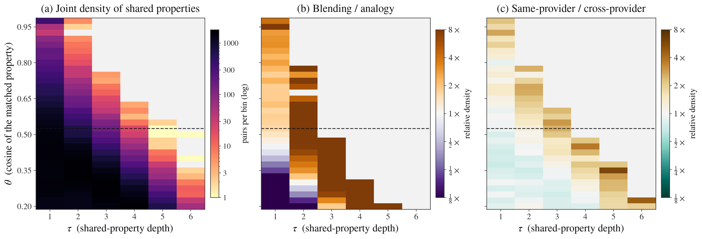

# Inventive Multiples in Kombine

*2026-09-01, redone 2026-09-09 on the 35-model pool with the τ-criterion · kg_creat track · analysis memo*

**Question.** In the history of science, *multiples* are near-identical discoveries made independently by different people in the same period. Kombine lets us ask the model analogue: given the same anchors `(u, v)`, how often do two independent models invent the *same* new entity, and what predicts it? We call such a pair an **inventive multiple**.

**What changed since the last version.** Four things, each of which moved a headline number.

1. **The criterion is property overlap and nothing else.** The abstraction clause (a shared generic space or projected source) is gone; it was a second claim riding on the first. The abstraction is still computed and shown, never used.
2. **τ is the reported axis**, not a hidden constant: a *τ-inventive multiple* re-uses at least τ properties, and every rate is given at every τ the data supports. The prose quotes τ = 2.
3. **θ is calibrated**, not typed. The property-match cosine is set at 0.545 against a cross-item null (α = 0.24%), replacing an underived 0.58.
4. **Anchor echo is removed.** A property whose object *is* one of the anchors (`(X, resembles, Pi)` on *(Don Quixote, Pi)*) is supplied by the item, not invented, and it is 8.7% of what analogy inventions assert. Filtering it cuts the analogy rate by 2.6× and is the single biggest change to the blend/analogy comparison.

And the pool grew from 30 to 35 models, so every rate is recomputed over 34,687 co-response pairs.

## Claims

1. **Nearly half of all inventions are re-invented by another model, but the convergence is shallow.** At τ = 2, 5.9% of co-response pairs are multiples and **46%** of inventions are in at least one (85% of blends, 7% of analogy inventions). Requiring three shared properties leaves 1.0% of pairs; four leaves 24 pairs in the whole benchmark.
2. **Blends produce multiples 36× as often as analogies at fixed τ, and 2–6× as often once property count is held fixed.** The fixed-τ ratio is mostly that blends assert twice as many properties. Normalised per property the advantage is **3.2×** (paired Wilcoxon p = 4×10⁻⁹); with verbatim, encoder-free matching **2.0×** (p = 1.5×10⁻³); within size-matched strata 4.5–6.2×.
3. **Models from the same provider form multiples 2.0× as often** as cross-provider pairs (10.3% vs 5.1%, permutation p = 5×10⁻⁴), within each task and on the per-property route too.
4. **The largest clusters are chains, not consensus.** Chaining multiples into components links all 35 models on *(Photosynthesis, Bread)*, but only 18% of that component's member pairs are multiples themselves (mean over clusters: 57%).

## What counts as a near-identical invention

The measurement never sees a name. Every triple of an invention is reduced to **"relation object"** — the coined name is the subject of all of them, so dropping it turns the comparison into what a model *says about* its invention rather than what it *calls* it. Two properties are *the same* when the cosine between their `all-MiniLM-L6-v2` embeddings is ≥ θ = 0.545; properties are matched **one-to-one** by greedy assignment, so a single generic property cannot satisfy several; and a pair of inventions (same task, same anchor pair) is a **τ-inventive multiple** when at least τ properties match.

**Two exclusions, both because the text is supplied by the item.**

- The invention's own **name**, the subject of every triple it asserts.
- **Anchor echo**: any property whose object, normalised, is one of the two anchors. Exact match on the object, not word overlap — `emits light` on *(Mount Everest, The light bulb)* is a real property and survives.

| Task | Properties per invention (raw → filtered) | Anchor-echo properties | Inventions left with < 2 properties | τ = 2 rate (raw → filtered) |
|---|---|---|---|---|
| Analogy | 2.60 → 2.37 | 234 / 2,692 (**8.7%**) | 214 / 1,037 (21%) | 0.82% → **0.32%** |
| Blending | 5.01 → 5.00 | 14 / 5,176 (0.3%) | 0 | 11.54% → 11.44% |

**θ is a detection threshold with a stated false-positive rate.** Two inventions answering *different* anchor pairs cannot share an item-specific property, so their greedy matches are a null (185,480 matched property pairs from 60,000 draws). θ = 0.545 is the null's 99.76th percentile: α = 0.24%, one property pair in ~400 drawn from unrelated inventions clears the bar. For reference, α = 1% gives θ = 0.450 and α = 0.1% gives θ = 0.604. The same-name label is held out of this calibration and reported against it (below), never fitted.

**The name is the held-out check.** Same-name pairs re-use **0.85** properties on average against **0.32** for the rest, so the criterion tracks naming without being driven by it — but only **21%** of the 753 same-name pairs are multiples. Naming convergence and property convergence are related and distinct, and only the latter is measured here. A relational match (Jaccard over relation labels) is unusable as a criterion: even same-name pairs have median relation-Jaccard 0 (mean 0.05), because the relation vocabulary is open.

## Data & sampling

**Sample frame.** 35 models × 30 anchor pairs × 2 tasks (analogy, blending), one invention per model per (task, anchor pair) at T = 0.9: **2,070 inventions, 34,687 pairs of models responding to the same task and anchors** (17,411 analogy, 17,276 blending). The models are a convenience sample of ten providers chosen for availability and coverage, not a random draw; the anchor pairs are the benchmark's 30. Pairs are not independent — each model sits in 34 pairs per item — so every test below uses the anchor pair (n = 30, paired Wilcoxon) or a model-label permutation (n = 35) as its replication unit, never the pair. Findings describe *these* models on *these* anchor pairs.

## How often (Claim 1)

| τ | Pairs | % of pairs | Blending | Analogy | Inventions in ≥ 1 multiple (all / blend / analogy) |
|--:|--:|--:|--:|--:|---|
| 1 | 9,019 | 26.0% | 45.5% | 6.7% | 82.9% / 99.9% / 66.0% |
| **2** | **2,032** | **5.9%** | **11.4%** | **0.32%** | **46.1% / 85.0% / 7.4%** |
| 3 | 330 | 0.95% | 1.9% | 0.01% | 16.6% / 33.1% / 0.2% |
| 4 | 24 | 0.07% | 0.14% | 0 | 1.9% / 3.8% / 0 |
| 5 | 2 | 0.01% | 0.01% | 0 | 0.2% / 0.4% / 0 |

The cross-item null at τ = 2 is 0.02% (blending) and 0.00% (analogy), so the multiples are convergence on the item, not generic phrasing. 47 of 60 (task, anchor) settings produced at least one multiple; **69 clusters** (41 blending, 28 analogy).

**Clusters are components, not cliques (Claim 4).** A cluster is the connected component of multiple-pairs on an item. Eight blending items link 32 or more of the 35 models, and *(Photosynthesis, Bread)* links all 35 — but a component of 35 is not 35 models asserting the same thing. Within-cluster pair density (share of member pairs that are themselves multiples) averages **0.57** over the 69 clusters and is **0.13–0.35** for the eight giant ones. The largest analogy cluster has 10 models.

| Anchors | Task | Models | Density | Representative names |
|---|---|--:|--:|---|
| Photosynthesis + Bread | blend | 35 | 0.18 | Helio-Loaf, Photobread, Breadzyme |
| Opera + Documentary film | blend | 33 | 0.35 | Docera, Docu-Opera, Aria vérité |
| Vaccines + Ethics | blend | 32 | 0.18 | Ethical Inoculation, Conscience vaccine |
| The oak tree + Chess | blend | 32 | 0.17 | Arboreal Gambit, Chessgrove |
| The social contract + Prayer | blend | 32 | 0.14 | Covenant Invocation, Civic Invocation |
| Hinduism + Gravity | blend | 32 | 0.21 | Karma field, Dharma Gravity, Cosmic Karma |
| Adam Smith + Bacteria | blend | 32 | 0.13 | Econobacter, Invisible Hand Biofilm |
| Networks + Salt | blend | 32 | 0.17 | Ionic Mesh, Crystalline Grid, Brine Circuit |


*Figure 1. Every model's invention for two anchor pairs; shape = task, colour = provider, size = composite emergent creativity. Shaded regions are connected components of inventive multiples, labelled with the shared invention and the number of models. Positions come from metric MDS on the cosine distance between asserted properties, with distances inside a component scaled by 0.55 so it reads as one group rather than a chain (normalized stress 0.27 and 0.26).*


*Figure 2. The (Hinduism, Gravity) component as a model × property matrix: rows are its eight most re-used properties, a filled cell marks a model asserting one, and the right-hand block is the two models on the item that built something else. Read across a row to see how the component holds together: no property is asserted by more than 21 of the 32 members.*

## What predicts convergence (Claims 2–3)

### Task: the fixed-τ ratio is mostly property count

At τ = 2 blends are multiples **11.4%** of the time and analogy inventions **0.32%** (paired Wilcoxon over 30 anchor pairs, p = 1.9×10⁻⁹); the encoder-free name-match cut agrees on direction (4.1% vs 0.2%, p = 2.9×10⁻⁶). But a fixed τ is not a fair operator comparison: a blend carries 5.0 properties and an analogy invention 2.4, so τ = 2 is a 40% bar for one and an 85% bar for the other, one analogy invention in five carries a single property and cannot qualify at all, and the chance of sharing ≥ 2 grows superlinearly with how many there are to share. Five routes remove the property-count advantage:

| Route | Blending | Analogy | Ratio | Test |
|---|--:|--:|--:|---|
| τ = 2 multiples, all pairs (% of pairs) | 11.44 | 0.32 | **36.2×** | Wilcoxon p = 1.9×10⁻⁹ |
| τ = 2, eligible pairs only (both inventions ≥ 2 properties) | 11.44 | 0.50 | 22.7× | — |
| τ = 2, excess over cross-item null | 11.42 | 0.31 | 36.5× | — |
| Per-property re-use (share of the smaller invention's properties re-used) | 0.129 | 0.040 | **3.2×** | Wilcoxon p = 3.7×10⁻⁹ |
| … excess over cross-item null (0.003 / 0.001) | 0.125 | 0.039 | 3.2× | — |
| Exact-match per-property re-use (verbatim objects, no encoder) | 0.0223 | 0.0113 | **2.0×** | Wilcoxon p = 1.5×10⁻³ |
| Size-matched, both inventions ≥ 3 and smaller = 3 (n = 265 / 3,266) | 5.28% | 0.86% | 6.2× | — |
| Size-matched, smaller invention = 4 (n = 8,179 / 201) | 8.90% | 1.99% | 4.5× | — |

Eligibility alone barely moves the ratio, because analogy inventions with two or three properties still share fewer of them; the routes that count *per property* put blending's advantage at 2–3×, and size-matched strata at 4.5–6×. The honest statement is that blends converge more than analogies by every route, by a factor between two and six, and that the 36× a fixed τ reports is mostly how much there is to share. Our reading is unchanged: fusing two fixed inputs admits only a few natural blends, whereas analogy leaves the source domain free, so analogies fan out where blends funnel.

**Sensitivity to θ.** At τ = 2 the overall / blending / analogy rates are 7.0 / 13.8 / 0.4% at θ = 0.53, 3.8 / 7.4 / 0.2% at 0.58 and 2.0 / 3.9 / 0.1% at 0.63. Absolute rates move with θ, as they must; the direction does not, at any τ.



*Figure 3. Each co-response pair contributes one point per matched property at (τ = its rank, θ = its cosine), so the mass above a horizontal line in column τ is the multiple count at that (τ, θ). (a) joint density; (b) blending / analogy and (c) same-provider / cross-provider relative density, each subset normalised to 1, masked below 30 pairs per bin. The dashed line is θ = 0.545.*

### Model kinship

Same-provider pairs are multiples **10.3%** of the time vs **5.1%** for cross-provider pairs — relative risk 2.0; a permutation test reshuffling the provider label across the 35 models (2,000 relabelings, pair structure preserved) gives **p = 5×10⁻⁴**. The effect holds within blending (19.8% vs 10.1%) and within analogy (0.65% vs 0.26%), and on the per-property route (0.108 vs 0.081, 1.34×, permutation p = 5×10⁻⁴), so it is not a property-count artefact. Multiples are slightly less original than singletons (0.43 vs 0.48): the rediscovered inventions are the more obvious ones.

### Anchor distance: still not a finding

| Operator | Spearman | Pearson | Leave-one-out | Rate by distance tercile (near → far) |
|---|---|---|---|---|
| Blending | ρ = +0.34 (p = 0.067) | r = +0.42 (p = 0.022) | 5/30 deletions reach p < 0.05 | 10.4% → 9.7% → 14.5% |
| Analogy | ρ = +0.06 (p = 0.77) | r = +0.28 (p = 0.14) | 0/30 | 0.2% → 0.1% → 0.6% |

The unit is the anchor pair (n = 30), per task. Blends converge most on the farthest third, but the rank correlation does not clear p < 0.05 and fails leave-one-out, so this is reported as a null.

## What the `uv` re-elicitation changed

Blending only, identical pipeline both sides, restricted to the 21 models that have a pre-v3 backup so the format change is not confounded with the pool change (`--prepost`):

| | pairs | nominal | ≥ 1 property | τ = 2 | clusters (max) | same / cross provider | distance ρ |
|---|--:|--:|--:|--:|---|---|---|
| pre-`uv` | 6,280 | 4.6% | 60.9% | **23.4%** | 35 (21) | 35.7% / 21.5% | +0.43 (p = .018) |
| post-`uv` | 6,300 | 4.7% | 47.0% | **12.0%** | 49 (21) | 19.4% / 10.8% | +0.15 (p = .42) |

Name agreement is unchanged; property agreement halves, and the number of distinct clusters rises as models split onto different shared structures instead of converging on one. Asking for a slot both inputs organize makes models commit to *which* shared structure they mean, and they do not all pick the same one. The earlier convergence numbers were partly a format artifact, and the format fix is what exposed it.

## Examples

Full members of every cluster — each invention with its generic space (blend) or projected source (analogy) and its tagged structure — are generated from the analysis output, not typed:

- [`examples_section.md`](examples_section.md) — the largest cross-family clusters, in markdown.
- [`multiples_showcase.html`](multiples_showcase.html) — all 69 clusters, browsable, each with the models that answered the same item and built something else.

## Limitations and red-team

- **Shallow convergence is the load-bearing finding and survives the definition.** At every θ swept, the rate collapses from τ = 2 to τ = 3.
- **The fixed-τ ratio is not the operator effect.** Anyone quoting 36× is quoting property count; the per-property and exact-match routes (2–3×) are the comparison to cite.
- **Anchor echo is a filter on objects only.** A property that paraphrases the anchor without naming it (`resembles a mathematical constant`) survives; the exact-match rule was chosen over word overlap because word overlap wrongly drops real properties. The residual echo, if any, inflates analogy, not blending.
- **Components are not consensus.** A 35-model cluster means 35 models are chained by pairwise overlap; the density column says how far from a clique each one is.
- **Single encoder.** Property matching rests on `all-MiniLM-L6-v2` (local); the exact-match route is encoder-free and agrees on direction.
- **Provider ≠ architecture.** Same-provider models also share size and era; "kinship" is training-lineage similarity broadly.
- **The pool is a convenience sample**; 30 anchor pairs, one draw per model at T = 0.9. Rates are specific to this pool.

## Reproduce

```
.venv_mlx/bin/python -m src.kg_creat.scripts.embed_inventions              # invention vectors (after any re-elicitation)
.venv_mlx/bin/python -m src.kg_creat.scripts.calibrate_theta               # theta against the cross-item null
.venv_mlx/bin/python -m src.kg_creat.scripts.analyze_inventive_multiples   # tau curve, routes, null, predictors, clusters
.venv_mlx/bin/python -m src.kg_creat.scripts.analyze_inventive_multiples --prepost   # the pre/post uv table
.venv_mlx/bin/python -m src.kg_creat.scripts.plot_tau_theta_grid           # Figure 3
.venv/bin/python -m src.kg_creat.scripts.make_multiples_showcase           # examples_section.md + showcase HTML
.venv/bin/python -m src.kg_creat.scripts.plot_invention_landscape          # Figure 1
.venv/bin/python -m src.kg_creat.scripts.plot_multiples_matrix             # Figure 2
.venv/bin/python -m src.kg_creat.scripts.make_paper_multiples_figure       # the stacked figure the paper includes
.venv/bin/python -m src.kg_creat.scripts.make_tau_multiples_table \
    data/kg_creat/kombine_test30/analysis/inventive_multiples.json \
    papers/kg_creat-iclr/media/04_tau_multiples.tex papers/kg_creat-iclr/media/07_task_routes.tex
```

The analysis reads `data/kg_creat/kombine_test30/analysis/invention_vectors.npz` and the response files, and writes every number quoted here to `data/kg_creat/kombine_test30/analysis/inventive_multiples.json` (`tau_curve`, `task_routes`, `anchor_echo`, `null`, `provider`, `clusters` with `density`); θ's derivation is in `theta_calibration.json`.
