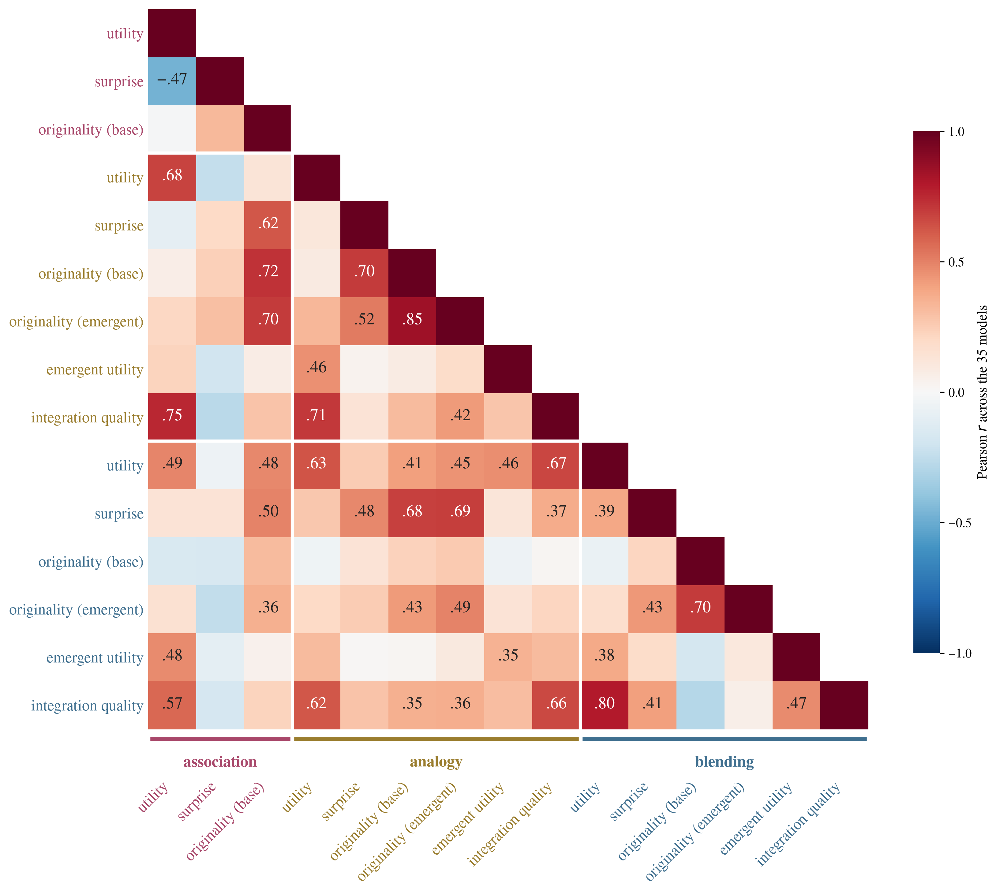

# Associative Ability Predicts Analogy, Not Blending — and Other Things the Facets Say

*2026-09-02, rewritten 2026-09-05 on the 30-model pool, the re-elicited blends, a corrected measurement, and the associative-hypothesis test · kg_creat track · analysis memo*

**Question.** Kombine scores three tasks on utility, surprise, originality, and — for analogy and blending — the emergent dimensions. Is there a creativity factor underneath them: an ability, or even a dimension, that a model carries from one task to the next? Because association is the task the Remote Associates tradition treats as the substrate of creative ability, the first question has a named hypothesis attached to it, and the answer is that it holds for one of the two combinatorial tasks and not the other.

## Claims

1. **Associative ability predicts structure mapping but not conceptual integration.** Treating the correlations as a test of Mednick's associative account — which says associative ability is the substrate creative ability is built on — a model's association score predicts its analogy score far better (**r = +0.74** [+0.52, +0.87]) than its blending score (**+0.44** [+0.10, +0.69]). The two correlations differ significantly (Williams' t = **3.17**, p = .004, and t = 3.07, p = .005 on utility alone). The hypothesis holds strongly for one of the two combinatorial tasks and only weakly for the other.
2. **What travels across all three tasks is validity; novelty travels only in pieces.** Utility chains association → analogy → blending at **r = +0.72** and **+0.68**, while the ends of the chain are much weaker (association ↔ blending utility **+0.40**, p = .028). Novelty is patchier: it carries from association to analogy (originality **+0.67**), and from analogy to how far a blend's schema abstracts from its inputs (analogy originality ↔ blend surprise **+0.68**, p < .001) — but *not* into how unusual that schema is relative to the pool (analogy ↔ blending originality **+0.28**, n.s.). Being right in one task predicts being right in the next more reliably than any one novelty dimension predicts another.
3. **The novelty–appropriateness tradeoff is one task's property, not a law of the benchmark.** In association, a model that stays valid is markedly less surprising (**r = −0.58**, p = 0.001). In analogy and blending the sign *reverses* — the models that succeed are the more novel ones (analogy utility ↔ emergent originality **+0.44**, p = .014; blending utility ↔ surprise **+0.37**, p = .044). The tension appears where the artifact is a *route between fixed anchors* and inverts where it is an *invented concept*.
4. **Inventiveness partly tracks capability, but does not reduce to it.** Mean emergent-invention originality correlates with the overall composite at **r = +0.47** (p = .008, Spearman +0.49); the five most emergent-original models still span overall ranks **1, 2, 11, 15 and 27**. This claim *reversed* when the pool grew: at n = 21 the correlation was +0.13 (n.s.). Adding nine weaker models widened the capability range, and a restricted range was suppressing it — a caution about reading any of these coefficients as pool-independent.

## The measurement, which is load-bearing

The obvious way to run this analysis gives nonsense, and it is worth saying why before the numbers.

Kombine *scores* each dimension **utility-gated**: an artifact's surprise, originality and emergent values count only if that artifact passed utility, and count 0 otherwise. Gating is right for scoring — it stops novelty from failed artifacts inflating a model — but it makes every dimension the same 0/1 mask times something, so correlating the scored dimensions returns **r > 0.99 for every pair** and the matrix says only *utility correlates with utility*. That is a measurement artifact, not a hivemind.

The tempting repair — average each dimension over the artifacts that *passed* — is also wrong: a model passing 40% of the time is then described by its own best 40%, and every model is described on a different subsample.

So the dimensions here are **ungated means over every artifact the model produced, pass or fail**: how remote, original and well-integrated its output is, whether or not it was valid. Utility stays the pass rate, which is what utility measures. One denominator for every model, and the facets are free to disagree.

## Data & sampling

**Frame.** 30 models, one point per model, on the 30-item-per-task Kombine run (temperature 0.9, one draw per model per item): 900 association responses, 900 analogy pair-heads, 900 blends. The replication unit for every correlation below is the **model**, so every reported *n* is 30 and **|r| ≥ 0.36 is p < 0.05**. Individual coefficients are noisy at this n; the block structure carries the claims and each cell's p-value is in the JSON.

**Scope.** These are correlations *among this pool of 30 models on these 30 anchor pairs*. They describe how the benchmark's dimensions relate over the current frontier, not a population of models. All 15 (task, dimension) pairs are included, blend surprise among them: it is the mean distance from each input to the blend's generic space — which the model writes — so it varies by model (30 distinct values per item, within-item SD 0.05), unlike in an earlier scorer where it was fixed by the item.



*Figure 1. Pearson correlation between every pair of (task, dimension) values across the 30 models, ungated. Diverging scale about r = 0; cells clearing p < 0.05 carry their value. Blocks are the three tasks.*

## Finding 1 — the associative hypothesis, as a test the benchmark can fail

Association is the task Kombine shares with the Remote Associates Test tradition: connect two distant concepts by a path. The associative account of creativity — Mednick's claim that creative ability *is* the ability to bring remote elements into useful combination — predicts that this ability should carry into both tasks built on top of it: analogy, which aligns two domains and projects across them, and blending, which fuses them through a shared schema. Kombine measures all three on the same 30 models, so the prediction is testable and falsifiable.

| level | association ↔ analogy | association ↔ blending | difference |
|---|---|---|---|
| task composite | **+0.74** [+0.52, +0.87] | +0.44 [+0.10, +0.69] | **t = 3.17, p = .004** |
| utility | **+0.72** [+0.49, +0.86] | +0.40 [+0.05, +0.67] | **t = 3.07, p = .005** |
| originality | +0.67 [+0.41, +0.83] | +0.34 [−0.03, +0.62] | t = 1.93, p = .065 |

The two correlations share the association variable, so the comparison is a dependent, overlapping one: Williams' t, which uses r(analogy, blending) = +0.72 to account for the shared term. Brackets are 95% Fisher intervals. The gap is significant at the composite and at utility; at originality the direction is identical and the test now sits just outside significance (p = .065).

**Associative ability predicts structure mapping and not conceptual integration.** Being able to build a good path between two concepts says a model can align two domains and project across them; it says nothing about whether it can find a generic space that both inputs genuinely instantiate.

Individual models make the dissociation concrete. Ranks out of 30, largest gaps first:

| model | association | blending |
|---|--:|--:|
| gpt-5-mini | **5** | 25 |
| gemini-2.5-flash | **9** | 28 |
| gemini-3.1-pro | 17 | **2** |
| glm-4.5-air | 29 | **15** |
| claude-fable-5 | 15 | **4** |

gpt-5-mini is top-five at remote association and 25th of 30 at fusion; gemini-3.1-pro is the reverse. If a human sample showed profiles this crossed it would be surprising — the abilities are supposed to run together. This is the concrete form of "jagged" capability: not that models are uniformly weaker than people, but that the abilities a single construct is supposed to bundle come apart per model.

**Two limits on the claim.** With n = 30 the blending correlation's interval runs [+0.10, +0.69], so association and blending *are* related — what is established is that association predicts analogy **significantly better than** it predicts blending, not that the two are independent. (At n = 21 that interval spanned zero; the larger pool has moved this from "no relationship" to "a weaker relationship", and the Williams' test is the claim either way.) And there is no human comparison yet: the generation study is built but not fielded, so the contrast with human profiles is a prediction, not a result.

## Finding 2 — validity chains, novelty does not

| pair | utility | base originality |
|---|--:|--:|
| association ↔ analogy | **+0.72** (p < .001) | **+0.67** (p < .001) |
| analogy ↔ blending | **+0.68** (p < .001) | +0.28 (p = .13) |
| association ↔ blending | **+0.40** (p = .028) | +0.34 (p = .068) |

Read down the utility column: a model that produces valid associations produces valid analogies, and a model that produces valid analogies produces valid blends — while the two ends of that chain are linked only weakly. Analogy is the hub, which the per-task composites say as well (association ↔ analogy +0.74, analogy ↔ blending +0.72, association ↔ blending +0.44). Analogy needs the factual grounding association rewards *and* the projection blending rewards; the endpoints need neither of each other.

Now read the originality column. Novelty transfers between association and analogy — both build a path of triples over the same anchors, so a model whose bridges are remote also maps remotely (association originality ↔ analogy *emergent* originality reaches **+0.70**, p < .001). Across the analogy/blending boundary the *pool-relative* base originality falls to +0.28 (n.s.).

But one novelty channel does cross that boundary, and it is the one that measures distance rather than rarity: **analogy originality ↔ blend surprise +0.68** (p < .001), and analogy emergent originality ↔ blend surprise **+0.72** (p < .001). A model that invents remotely in analogy also abstracts further from the inputs when it blends — its generic space sits further from `u` and `v` — yet that schema is no more unusual *relative to the other models'* than anyone else's (blend surprise ↔ blend originality **+0.30**, n.s.). Reaching further and landing somewhere nobody else landed are separate things, and only the first one travels.

## Finding 3 — the tradeoff lives in association

| task | utility ↔ surprise | utility ↔ originality | utility ↔ emergent originality |
|---|--:|--:|--:|
| association | **−0.58** (p = .001) | −0.12 (p = .51) | — |
| analogy | +0.23 (p = .22) | +0.26 (p = .17) | **+0.44** (p = .014) |
| blending | **+0.37** (p = .044) | +0.07 (p = .72) | +0.29 (p = .12) |

The novelty–appropriateness tension that creativity research treats as fundamental shows up cleanly in exactly one of the three tasks — and in the other two the sign flips, so novelty and success go *together*. The reading that fits the task structure: an association is a *route* between two fixed anchors, and a remote route is more likely to be false, so remoteness is bought with correctness. An analogy or a blend is an *invented concept* — its novelty comes from what the model builds, not from how far it reached, and the models that build well also build unusually.

Within a task the dimensions behave as designed: surprise and originality move together (analogy **+0.65**), base and emergent originality are related but not redundant (analogy **+0.86**, blending **+0.76**, i.e. 26–42% unshared variance), and utility travels with integration quality (analogy **+0.76**, blending **+0.78**).

## Finding 4 — inventiveness tracks capability only loosely, and this one moved

Mean emergent-invention originality against the overall composite: **r = +0.47** (p = .008), Spearman **+0.49**. The five most emergent-original models are claude-opus-5 (**rank 11**), gemini-2.5-pro (**15**), gemini-3-flash (**27**), gpt-5.6-sol (**1**) and grok-4.6 (**2**) — still a spread across the entire leaderboard, with the third-from-last model in the pool among the five most original inventors.

**This finding reversed when the pool grew, and that is the more useful lesson.** At n = 21 the same correlation was +0.13 (p = .58) and the report said inventiveness was *uncorrelated* with capability. Adding nine cheaper, weaker models widened the range of model strength, and the correlation appeared. Neither number is wrong; the earlier one was computed over a restricted range. Any correlation in this report is a property of *this pool*, and the ones involving overall capability are the most pool-sensitive of them.

What survives both versions is the weaker, and sufficient, claim: **the leaderboard does not order models by inventiveness.** A single number ranks gemini-3-flash 27th and says nothing about the property on which it is near the top.

## Limitations and red-team

- **n = 30 models.** Every correlation here is one point per model. |r| ≥ 0.36 is the p < 0.05 line, and we lean on the pattern (the utility chain, the association-only tradeoff) rather than on any single coefficient.
- **The measurement choice is a judgement**, and it changes the answer completely: gated dimensions give r > 0.99 everywhere, conditional means give a third set of numbers again. Ungated is defensible because it fixes the denominator, but it means a model's novelty score includes artifacts that were wrong. The three framings answer three different questions and none is neutral.
- **Correlational and observational.** Nothing here is causal, and the models are a convenience sample of what was current in September 2026, heavy on OpenAI/Anthropic/Google.
- **Range matters, and this pool's range changed.** Nine cheaper models were added in the 2026-09-05 round, widening the spread of model strength. Correlations involving overall capability moved as a result (Finding 4 changed sign of conclusion). Read every coefficient as conditional on this pool's composition, not as an estimate of a population value.
- **Task composites are gated** (they are the benchmark's own scores) while the facets are ungated, so Finding 1's two halves are not measured identically; the utility chain is visible in both framings.
- **A near-ceiling result was left out.** Analogy originality against blend coherence is r = −0.73 (Spearman −0.76, robust to leave-one-out), but blend coherence ranges only 0.92–1.00 across the pool — a strong correlation over a range too thin to carry a claim.

## What changed across versions of this report

**From the original (2026-09-02, pre-`uv` blends, 21 models).** Three claims did not survive the blend re-elicitation:

- *"Emergent-invention originality partly transfers across tasks (r = 0.46)"* — the base-originality version of this is still n.s. (**+0.28**), though the emergent-to-emergent channel does travel (**+0.57**, p = .001).
- *"Within a task, utility trades off against novelty"* — holds for **association only**; in analogy and blending the sign is positive.
- *"The most inventive models are mid-tier"* — the top five span ranks 1 to 27.

**From the second version (2026-09-05 morning, 21 models, ungated).** Growing the pool to 30 changed one conclusion and sharpened the rest:

- **Finding 4 reversed.** Emergent originality vs the composite went from +0.13 (n.s.) to **+0.47** (p = .008) — a restricted-range effect, not a data error.
- **Finding 1 strengthened.** The association↔analogy vs association↔blending gap went from t = 2.24 (p = .038) to **t = 3.17 (p = .004)**, and the association↔blending interval no longer spans zero, so the claim is now "predicts one much better than the other" rather than "predicts one and not the other".
- **Association↔blending utility became significant** (+0.21 n.s. → **+0.40**, p = .028), so the utility chain's endpoints are weakly linked rather than independent.

What survives every version is the qualitative frame: task, not dimension, is the organizing axis, and the dimensions are not redundant.

## Reproduce

```
.venv/bin/python src/kg_creat/scripts/compute_composite.py data/kg_creat/kombine_test30/scores
.venv/bin/python -m src.kg_creat.scripts.analyze_facet_correlations
```

The second script writes every coefficient and p-value quoted here to `data/kg_creat/kombine_test30/analysis/facet_correlations.json` and regenerates Figure 1. Dimensions are read from each model's `path_scores.json`, not from the gated values in `composite.json`.
