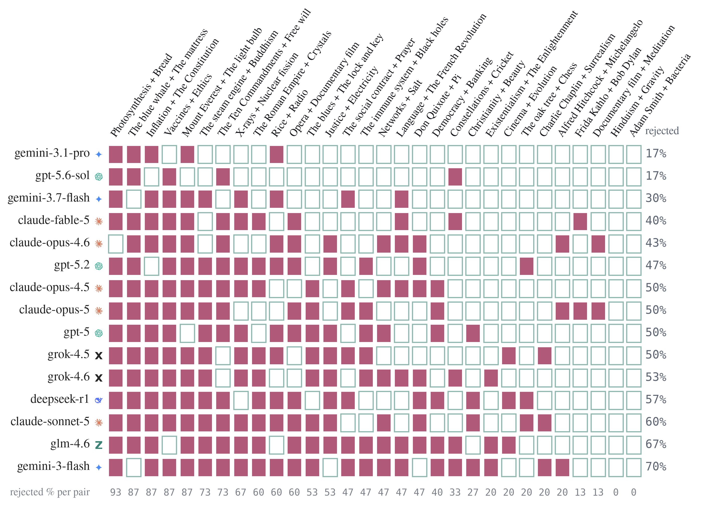

# How Frontier Models Fail on Kombine

*2026-09-03, rebuilt 2026-09-05 from a script · kg_creat track · analysis memo · **two numbers in the first version were wrong**, see the correction below*

> **Correction.** The first version of this report was assembled by hand from the scored files, and two
> of its three headline numbers were errors, not data changes:
> **(1)** the analogy path gate was reported as "72% pass / 20% factual / 8% structural" — those are the
> *association* figures, copied into the analogy row. Analogy paths are much cleaner: **88% pass, 10%
> factual**. **(2)** the two analogy-invention gates were swapped: "19% mapping-not-applied, 7%
> incoherent" is really **8% mapping-not-applied, 20% incoherent**, and the per-model figures attributed
> to skipped mappings ("opus 20–27%, grok 0%") were incoherence rates (opus-4.5 20.0%, opus-4.6 26.7%,
> both groks 0.0%). The underlying scores are unchanged — association and analogy channels are identical
> in the pre-`uv` backup — so this was a reading error at the keyboard, which is why the analysis is now
> a script. The blending numbers moved for a real reason: the blends were re-elicited with the `uv`
> shared-slot format after the first version was written.

**Question.** The leaderboard says how *much* frontier models score; it does not say *how* they fail. Every scored artifact carries the gate that rejected it, so the breakdown is a count.

## Claims

1. **Hallucinated connective facts are an association problem, not a general one.** 21% of association path triples are rejected as false, against **10%** of analogy path triples. The pressure that produces fabricated links is the demand to *route between two fixed anchors*, and analogy — which builds two domain paths separately before aligning them — is half as prone to it.
2. **Blending fails at the abstraction, and only there — call it *shared abstraction failure*.** **47%** of frontier blends are rejected because the generic space is instantiated by one input only, while the model asserts that both instantiate it. Past that gate, **97% are coherent** and **76% reach full double-scope**. Model spread on this one gate is 17%–70%, it does not track general capability, and **every one of the 30 anchor pairs was solved by some model** — so it is a model failure, not an item difficulty.
3. **The analogy invention's problem is coherence, not fidelity.** Models apply the mapping they announced 91.5% of the time; what fails, in **20%** of inventions, is that the result does not hold together as one concept. This is family-specific: both Grok models are at 0% incoherence, claude-opus-5 at 37%.

## Data & sampling

**Frame.** The 30-model Kombine run at temperature 0.9, one draw per model per item. The **frontier subset** is 15 recent flagships, named explicitly in the script rather than described: the GPT-5.x models, Grok-4.5/4.6, Claude Opus-4.5/4.6/5, Fable-5, Sonnet-5, Gemini-3.x, DeepSeek-R1, GLM-4.6. Counts below are frontier unless stated: **7,079 association paths, 446 analogy pair-heads, 450 blends**. Utility on association and analogy is a single factuality judge; the blend gate and both invention gates are 3-judge panel majorities (ICC 0.48–0.65).

| task | pass | dominant failure | other |
|---|--:|---|---|
| association | 71% | **factual (hallucination) 21%** | structural 7% |
| analogy (path gate) | 88% | factual 10% | structural 2% |
| analogy (invention) | — | **incoherent 20%** | mapping not applied 9% |
| blending (abstraction gate) | 53% | **one-sided generic space 47%** | — |

All-30-model figures are worse throughout, as the pool now includes nine cheaper models: association 62% pass, analogy 87%, blending 43%. Every frontier number in this report is unchanged by the pool growth — the frontier subset is the same 15 models.

## Finding 1 — fabricated connective facts, mostly in association

The most common association failure is a specific, plausible, false triple inserted to bridge the anchors:

- gpt-5.6-sol, *Mount Everest → Winston Churchill*: `(Mount Everest, first overflown by, Westland PV-3)`
- gpt-5, *Surfing → The Industrial Revolution*: `(Duke Kahanamoku, arrived on, RMS Niagara)`

The fabrications sit at the *specific-entity* level — a particular aircraft, ship or date — which is exactly the connective tissue a multi-hop path between distant anchors needs and the model does not have. That analogy runs at half the rate (10%) is the interesting half of the comparison: the same models, the same anchors, the same judge, but an artifact that never has to assert a chain *between* the two domains.

## Finding 2 — the blend bottleneck is the generic space

A genuine blend needs a `g` that both inputs instantiate. 47% of frontier blends fail there, and the failure has one shape — a schema borrowed from one input and forced onto the other:

- claude-fable-5, *X-rays + Nuclear fission* → g: "penetrating rays released when an atom's inner structure is broken open." Judge: *"X-rays are NOT produced by 'breaking atoms open' — they result from electron transitions or electron bombardment of metal."*
- claude-opus-4.5, *Democracy + Banking* → g: "a system that pools member contributions to fund collective outcomes." Judge: *"not a natural, specific schema that democracy genuinely instantiates."*

**Past the gate the work is good**: 97% coherent, 76% at full scope 3. Frontier models elaborate a blended space competently and cannot reliably find a schema to elaborate.

**The gate is not measuring distance, which is worth knowing before anyone tries to automate it.** If "unequally instantiated" were a proximity fact, a rejected `g` would sit closer to one input than to the other. It does not: mean |d(u,g) − d(v,g)| is **0.1138 for rejected blends and 0.1167 for accepted ones** (n = 276 vs 354, Mann-Whitney p = 0.76, rank-biserial −0.01). The panel is detecting whether each input *instantiates* the schema — a relation the embedding does not represent — so this gate cannot be replaced by a cheap cosine, and any future automation of it has to be validated against the panel rather than assumed.

**The geometry does show one thing the gate does not: a position effect.** The generic space sits closer to the **second-listed anchor in 59.5%** of blends (mean signed difference +0.031, Wilcoxon p = 1.2×10⁻⁷), and near-identically among failures (55.8%). So models lean toward the second input when abstracting, regardless of whether the result passes. It is small, it is not what separates pass from fail, and it is an argument for counterbalancing anchor order in future runs — at present every item presents `u` before `v` to every model.

Per-model rejection rate at this gate, frontier models:

| gemini-3.1-pro | gpt-5.6-sol | gemini-3.7-flash | fable-5 | opus-4.6 | gpt-5.2 | opus-4.5 | opus-5 | gpt-5 | grok-4.5 | grok-4.6 | r1 | sonnet-5 | glm-4.6 | gemini-3-flash |
|--:|--:|--:|--:|--:|--:|--:|--:|--:|--:|--:|--:|--:|--:|--:|
| 17% | 17% | 30% | 40% | 43% | 47% | 50% | 50% | 50% | 50% | 53% | 57% | 60% | 67% | 70% |

A four-fold spread on a single gate, with gemini-3.1-pro and gpt-5.6-sol at one end and gemini-3-flash at the other. Blending rank is largely *this* skill.

## Shared abstraction failure

The blend gate has one dominant failure, and it is worth a name because it recurs, it is specific, and it is invisible in the output text. Call it **shared abstraction failure**: the model states a schema, asserts that both inputs instantiate it, and only one of them does.

It is not a refusal, a hedge, or a malformed answer. Every blend in the corpus claims a shared slot — 884 of 885 emit at least one `uv`-tagged triple — and the schema is usually fluent, specific, and confidently written. *"A directed projectile penetrates a target and liberates what is hidden within"* is a good sentence. It is also X-rays' property, asserted of nuclear fission.

**The rate.** The panel rejects the schema in **47% of frontier blends** (210 of 450); **182** are scope 1, meaning no genuine shared slot survived verification. Per model it runs **17% to 70%**, and the spread does not track capability rank: gemini-3.1-pro and gpt-5.6-sol sit at 17%, gemini-3-flash at 70%.

**It is a model failure, not an item failure.** Every one of the **30 anchor pairs has at least one accepted blend**. On the hardest pair, *Photosynthesis + Bread*, 14 of 15 frontier models fail and claude-opus-4.6 does not: the others write a schema built from one side — claude-opus-5's *"a slow process that builds solid volume out of gas taken from the air"* is photosynthesis, and claude-fable-5's *"captured energy and gas swell a starchy mass into stored food"* is bread — while opus-4.6 writes *"an activating agent causes inert substrate to rise into a structured energy rich product"*, which chlorophyll-in-light and yeast-in-dough both instantiate. The full catalogue of all 210 failures, each paired with the successes on the same anchors, is in [`generic_space_catalogue.md`](generic_space_catalogue.md).



*Figure 1. Shared abstraction failure across 15 frontier models and 30 anchor pairs. A filled cell means the 3-judge panel **rejected** the generic space — the schema is instantiated by one input only. Rows are sorted by failure rate (17%–70%), columns by difficulty (93% down to 0%). No column is fully filled: every anchor pair was solved by some model, so this is a model failure, not item difficulty. Cells are majority verdicts at ICC 0.48–0.65, not ground truth.*

**Everything downstream of the schema is fine.** Past the gate, 97% of blends are coherent and 76% reach full double-scope. Models elaborate a shared structure competently; what they cannot do reliably is find one.

### The task is hard on purpose, and that is the point

Kombine's anchor pairs are drawn to be distant and cross-domain, the model gets one attempt at temperature 0.9 with no retrieval, no tools and roughly 1,600 tokens, and the gate demands that *both* inputs genuinely instantiate the schema rather than that the sentence sound apt. A lenient reader would accept many of the 210. So 47% is a rate under deliberately unforgiving conditions and should not be quoted as a general error rate for LLM analogy-making.

The conditions are unforgiving in a way that mirrors the target use, though. Cross-domain transfer under exactly these constraints — two remote domains, no guarantee a shared structure exists, a single shot at naming it — is the setting the combinatorial account of discovery describes, and it is the setting in which "find a connection between X and Y" is actually deployed. The difficulty is not an artifact of the benchmark being contrived; it is the difficulty of the thing.

### What this implies for AI for science

**1. The dangerous output is the plausible one.** A shared abstraction failure does not look like a failure. It reads as a crisp statement of what two fields have in common, and its wrongness is a claim about one domain that a reader outside that domain cannot check. A hypothesis-generation pipeline that scores candidates on fluency, novelty, or embedding proximity will rank these *above* the correct ones, because they are usually cleaner sentences — the accepted schemas tend to be more awkward and more specific.

**2. Verification has to be content-level and two-directional.** We tested the cheap filter directly: if "unequally instantiated" were a proximity fact, a rejected schema would sit closer to one input than the other. It does not — |d(u,g) − d(v,g)| is 0.114 for rejected schemas and 0.117 for accepted ones (p = 0.76). There is no embedding shortcut. Catching this requires asking, separately for each input, whether *that* input instantiates the schema — which is what the panel does and what a domain expert or a retrieval-grounded check would have to do.

**3. Ensembling buys candidates, not answers.** Because every anchor pair was solved by someone, sampling several models makes it likely that at least one sound schema exists among the candidates. But the per-attempt failure rate is roughly a coin flip and the failures do not announce themselves, so an ensemble without selection just produces more plausible text. The value of running five models is entirely contingent on having the verifier from (2).

**4. Model choice matters more than model rank for this step.** A four-fold spread on one gate, uncorrelated with overall standing, means "use the best model" is the wrong heuristic. If a pipeline depends on framing two domains under a common schema, the models should be compared *on that gate* — which is cheap to measure once and stable enough to act on.

### What this implies for creative use

Trust the elaboration, check the framing. When a model fuses two concepts, its account of *what the two share* is a hypothesis with roughly even odds under these conditions; its development of that account, once given, is reliable (97% coherent). The productive division of labour is for the person to supply or vet the shared abstraction and let the model build on it — the reverse of how these tools are usually pointed at a blank page.

Two smaller, actionable findings. Input order is not neutral: the schema sits closer to the **second-listed anchor in 59.5%** of blends (p = 1.2×10⁻⁷), so a fusion prompt should counterbalance order or state it deliberately. And a shared name is not evidence of a shared abstraction — models that coin the *identical* name for a blend agree on the underlying schema less than half the time.

### Red-team

- **The gate is a 3-judge majority**, ICC 0.48–0.65, with a blind author check agreeing 66% overall and 75% where the panel is unanimous. Roughly half of these 210 rejections rest on a moderately reliable subjective call, and the rate would move with a stricter or looser panel.
- **One prompt, one draw, one temperature.** Nothing here bounds what the same models would do with retrieval, a scratchpad, or three attempts — and the ensemble result suggests attempts help.
- **The failures do not converge measurably.** They *look* alike on the hardest pairs (everyone reaching for "penetration"), but rejected schemas are more similar to each other than accepted ones on only 9 of 25 pairs (mean difference −0.034). "A recurring failure mode with a common shape" is supported; "models converge on the same wrong schema" is not.
- **Blending is one task.** This says nothing about whether the same weakness appears when the shared structure is given rather than sought.

## Finding 3 — the invention holds together, or it doesn't

Two gates apply to the analogy invention `h`: was the announced mapping actually applied, and does the result cohere? The second is the one that fails.

**Mapping not applied — 9%.** The invention is not `M[Φ]`: claude-fable-5 on *Rice ∷ Radio* and *The Ten Commandments ∷ Free will* (projecting `Φ` = compatibilism into *covenant compatibilism*), claude-opus-4.6 on *Alfred Hitchcock ∷ Michelangelo* (`Φ` = MacGuffin → *devotional lure*). Per model this runs 0% (opus-4.5, deepseek-r1, gpt-5.6-sol, grok-4.5) to 23% (opus-5).

**Incoherent — 20%.** The mapping is applied and the result still does not work as a concept. claude-fable-5 on *Photosynthesis ∷ Bread* projects `Φ` = Eucharist into *solar communion*, and the panel objects that the projection "introduces source triples about Eucharist … that exist outside the path structure and lack proper counterparts". Both Grok models are at 0% here; claude-opus-5 at 37%, opus-4.6 at 27%, opus-4.5 at 20%.

The Anthropic/xAI contrast is the same one the first version reported, with the right label on it: the Opus models produce fluent inventions that fail to cohere, the Grok models produce inventions that always cohere. Fluency and coherence trade off, and the trade differs by lineage.

**What does not explain incoherence.** Not the size of the projection: coherent inventions carry 2.63 image triples on average, incoherent ones 2.67 (p = 0.54). Not the remoteness of the source concept from the anchor either (p = 0.77). The one visible predictor is a **degenerate source** — a `Φ` that is already an entity inside the aligned paths, leaving nothing to project. Those inventions are coherent **22%** of the time against **76%** otherwise. It is a small class (18 of 619) and the interval is wide, but the direction is what the formalism predicts: `h := M[Φ]` needs a `Φ` drawn from the source domain and *not* already in the mapping, and models that reuse a path entity produce a projection that collapses.

## Limitations and red-team

- **Factuality is a single judge** (gpt-oss-120b). Spot-checking flagged triples turns up occasional false positives — one model's "cheese appears in Aesop's Fables" (true, via the Fox and the Crow) was marked false — so 21% is an upper bound.
- **The subjective gates are 3-judge majorities** with fair-to-good agreement (ICC 0.48–0.65) and a blind 60-item author check at 66% agreement (75% where the panel is unanimous). Noisy, and the per-model rates below are 30 artifacts each.
- **"Frontier" is a hand-drawn set of 15 models**, listed in the script so the choice is auditable; per-model rates on 30 artifacts should be read as tiers, not point estimates.
- **Examples illustrate their channel**, they are not randomly sampled.
- **Two of the three probes came back negative**, and they are reported that way: embedding asymmetry does not separate rejected from accepted generic spaces, and neither projection length nor source remoteness separates coherent from incoherent inventions. Negative probes of a gate are worth as much as confirmations — they say the gate is not reducible to the cheap proxy.
- **This report's own history is the caution.** Two of three headline numbers in the hand-built version were wrong in the same direction — they made analogy look as unreliable as association, and made the invention failure look like a fidelity problem rather than a coherence problem. Both are now computed by a script that prints its denominators.

## Reproduce

```
.venv/bin/python -m src.kg_creat.scripts.analyze_failure_modes
```

Writes every figure quoted here to `data/kg_creat/kombine_test30/analysis/failure_modes.json`, including the all-model and frontier-only breakdowns and both per-model tables.
